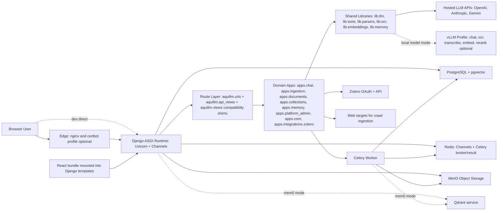
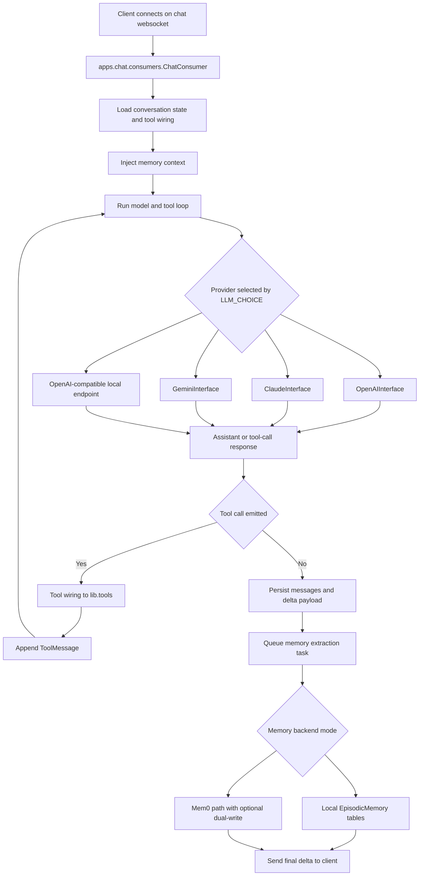
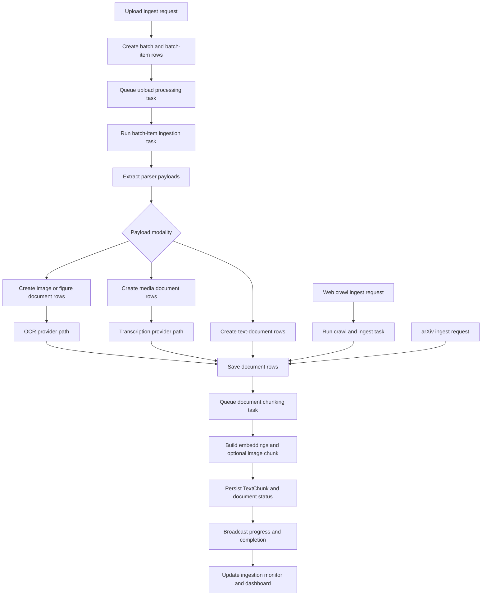
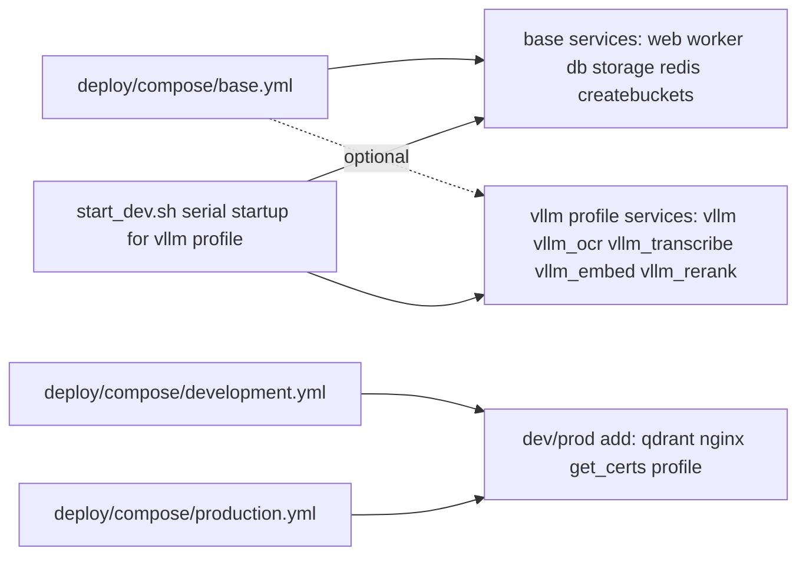

# AquiLLM Current Architecture (Code-Aligned)

Last updated: 2026-03-25

This document captures the architecture currently implemented in this repository (`main`-style runtime), including active compatibility layers and known limitations.

## 1) Runtime Boundary Map

## 2) Chat Runtime Flow (WebSocket + Tool Loop)

## 3) Unified Ingestion Flow (Batch + Parser + Chunking)

## 4) Deployment Composition (Current Compose Files)

## 5) Architecture Write-up (What It Includes)

### 5.1 Application Layering

- Django/Channels ASGI runtime handles HTTP pages, JSON APIs, and WebSockets in one process (`aquillm/asgi.py`, `aquillm/urls.py`).
- Domain ownership is in `aquillm/apps/*`.
  - `apps.chat`: WebSocket chat consumer, message persistence, tool wiring, feedback/rating writes.
  - `apps.ingestion`: upload/web/arXiv ingestion APIs, ingestion monitors, batch queue orchestration.
  - `apps.documents`: document polymorphic models, chunk model/search/rerank services, chunking Celery task.
  - `apps.collections`: hierarchy + permission model and APIs.
  - `apps.memory`: local user profile/episodic memory models.
  - `apps.platform_admin`: whitelist and feedback export APIs.
  - `apps.core`: common pages, health endpoint, user settings page.
  - `apps.integrations.zotero`: Zotero sync service/task.
- Shared non-Django logic is in `aquillm/lib/*`.
  - `lib.llm`: provider adapters, tool loop orchestration, prompt-budget logic.
  - `lib.tools`: reusable tool implementations (document search, astronomy, debug tools).
  - `lib.parsers`: multi-format extraction primitives.
  - `lib.ocr`, `lib.embeddings`, `lib.memory`: provider abstractions and fallbacks.

### 5.2 Compatibility Surface (Still Active)

- Compatibility barrels/shims remain runtime-active:
  - `aquillm/api_views.py` and `aquillm/views.py` still aggregate and expose route functions.
  - `aquillm/models.py` re-exports app models for legacy call sites.
  - legacy app names (`chat`, `ingest`) are still listed in `INSTALLED_APPS` alongside `apps.*`.
- Import-boundary safeguards exist (`scripts/check_import_boundaries.py`, integration tests), but the compatibility layer is still part of current architecture.

### 5.3 Data and Async Processing

- Primary data: PostgreSQL + pgvector; object/file blobs in MinIO.
- Real-time and async: Redis backs both Channels and Celery.
- Ingestion and memory writes are task-driven:
  - document chunking (`apps.documents.tasks.chunking.create_chunks`).
  - upload-batch processing (`aquillm.task_ingest_uploaded.run_ingest_uploaded_file`).
  - episodic memory creation (`create_conversation_memories_task`).
- Qdrant is present in dev/prod compose stacks and used when Mem0 backend mode is active.

### 5.4 Frontend Integration Model

- React is built to `aquillm/aquillm/static/js/dist/main.js` and loaded from Django templates.
- Templates expose URL maps via `window.apiUrls` and `window.pageUrls` (`aquillm/context_processors.py`).
- `window.mountReactComponent(...)` mounts feature components into template-defined mount points.

### 5.5 Chat Subsystem (Detailed)

- Transport and session model:
  - Primary chat transport is WebSocket at `/ws/convo/{id}/` routed to `apps.chat.consumers.ChatConsumer`.
  - Conversation ownership is enforced on connect (`WSConversation.owner` must match the authenticated user).
  - On successful connect, server sends a normalized conversation payload, then emits incremental `delta` or `stream` updates.
- Chat actions handled over the same socket:
  - `append`: add a user message, bind selected collection scope, optionally persist uploaded conversation files, then run LLM/tool loop.
  - `rate`: write 1-5 assistant rating against a message UUID.
  - `feedback`: write free-text feedback against a message UUID.
- Tool execution behavior:
  - Tools are composed at connect time from `apps.chat.services.tool_wiring`:
    - document/search tools (collection-scoped retrieval and document access),
    - astronomy file tools (FITS processing),
    - optional debug weather tool in `DEBUG`,
    - optional `message_to_user` tool for `LLM_CHOICE=GEMMA3`.
  - Tool call execution happens in `LLMInterface.call_tool` with timeout and argument normalization safeguards.
  - Tool results are appended as `ToolMessage` and can loop back into subsequent model turns.
- LLM orchestration:
  - `LLMInterface.spin` iterates assistant/tool turns up to configured guardrails (`CHAT_MAX_FUNC_CALLS`, per-tool repetition limits, timeout handling).
  - Provider dispatch is set at app startup (`AquillmConfig.ready`) based on `LLM_CHOICE`.
  - OpenAI-compatible path supports streaming callbacks; Claude/Gemini paths currently operate non-streaming.
- Persistence and naming:
  - Messages are persisted to `apps_chat.Message` rows (`sequence_number`, usage, tool-call metadata, ratings/feedback).
  - If a conversation has no name after early turns, the system attempts auto-titling via an LLM call with fallback to first-user-message heuristic.

### 5.6 Memory Subsystem (Detailed)

- Data model split:
  - `UserMemoryFact`: stable user preferences/facts categorized by type (tone/goals/project/preference/general).
  - `EpisodicMemory`: semantic memory rows with 1024-d embeddings and one-memory-per-assistant-message dedupe constraint.
- Injection lifecycle:
  - Before model generation (on connect and each append), `augment_conversation_with_memory` rebuilds system context:
    - base system prompt,
    - profile facts,
    - top-k retrieved episodic memories for latest user message.
  - Retrieved memory text is compacted/truncated before system injection to reduce token pressure.
- Write lifecycle:
  - After assistant turns persist, `create_conversation_memories_task` runs asynchronously.
  - Task extracts user/assistant excerpts and writes episodic memory entries.
  - Tool-only assistant placeholders are skipped.
- Backend modes:
  - `MEMORY_BACKEND=local`: retrieval/write from local pgvector-backed `EpisodicMemory`.
  - `MEMORY_BACKEND=mem0`: Mem0 retrieval/write path with OSS SDK first, cloud client fallback when configured.
  - `MEM0_DUAL_WRITE_LOCAL` optionally keeps local episodic rows even when Mem0 mode is active.
- Retrieval semantics:
  - Retrieval excludes the current conversation ID when provided to avoid immediate self-echo.
  - Mem0 retrieval failures fail-open to local retrieval (or empty result) rather than failing the chat turn.

### 5.7 UI Architecture (Detailed)

- Rendering model:
  - Hybrid server-rendered Django templates plus React feature islands mounted via `mountReactComponent`.
  - URL routing data is injected from Django context processors into `window.apiUrls` and `window.pageUrls` for client use.
- Chat UI:
  - `ChatShell -> Chat` owns in-browser conversation state and delegates socket lifecycle to `useChatWebSocket`.
  - Socket hook handles reconnect attempts, connection timeout, incremental stream/delta merge by `message_uuid`, and input-enable state.
  - Chat message renderer supports:
    - markdown (including GFM),
    - tool call/result panels,
    - inline images with click-to-open behavior,
    - per-message rating and free-text feedback controls.
  - Input dock includes context-usage gauge (`usage / contextLimit`) and collection-selection modal integration.
- Collections and document workspace UI:
  - Collection detail page hydrates from a single API payload (`collection`, `documents`, `children`, permissions).
  - Move/delete batch actions and collaborator management flow through API endpoints exposed in `window.apiUrls`.
  - Navigation to documents/collections is page-based (URL transitions), not full SPA routing.
- Ingestion UI:
  - Multi-row ingestion form lets users queue heterogeneous submissions (uploads/arXiv/pdf/vtt/web/handwritten) in one screen.
  - Unified upload rows poll `ingest_uploads/{batch_id}` for status and per-item parser metadata (modalities/providers/errors).
  - Ingestion monitor/dashboard also receives live progression over Channels WebSockets.

## 6) Current Limitations and Constraints

1. Ongoing migration complexity.
- Runtime still mixes compatibility modules (`aquillm.*`) with new `apps.*` structure, increasing cognitive overhead and import-surface size.

2. Legacy app registration remains.
- `chat` and `ingest` are still in `INSTALLED_APPS` even though active logic is in `apps.chat` and `apps.ingestion`, which keeps dual paths alive.

3. Streaming behavior is provider-asymmetric.
- OpenAI path supports incremental stream callbacks; Claude/Gemini adapters currently drop `stream_callback`, so UX/latency characteristics differ by provider.

4. Polymorphic document lookups scale through table fan-out.
- Several document operations iterate across all concrete document tables (`Document.get_by_id`, `Collection.documents`, permission-scoped document resolution), which can increase query cost as corpus size grows.

5. Web runtime performs frontend build steps on container start.
- `deploy/scripts/run.sh` runs `npm ci` and frontend/tailwind builds during web startup, increasing cold-start time and coupling web boot to Node toolchain availability.

6. Qdrant is always provisioned in dev/prod compose.
- Even when local memory backend is used, dev/prod service graphs include `qdrant` and web/worker `depends_on` entries, adding operational footprint.

7. Web crawl ingestion is heavyweight and environment-sensitive.
- Crawl task includes Selenium + webdriver-manager flow inside worker runtime; this can be brittle under restricted networking or driver/runtime mismatch.

8. Transcription provider path is narrow.
- Media transcription path currently accepts only an OpenAI-compatible provider mode (`INGEST_TRANSCRIBE_PROVIDER=openai`), limiting provider flexibility without code changes.

9. Memory writes are eventually consistent by design.
- Episodic memory persistence runs asynchronously after chat persistence, so newest turns may not be immediately retrievable on the next request if worker execution lags.

10. Chat reconnect strategy is simple and bounded.
- Client-side reconnect logic uses a fixed attempt cap and basic retry timing without advanced backoff/jitter tuning, which can degrade resilience under prolonged network instability.

11. UI routing is intentionally hybrid, not a unified SPA router.
- Many user flows are still page transitions between Django-rendered routes with React islands, which simplifies integration but limits single-app navigation/state continuity.

## Notes

- Dashed edges in diagrams represent optional/profile-based paths.
- This document is intentionally descriptive of current implementation, not target-state architecture.
