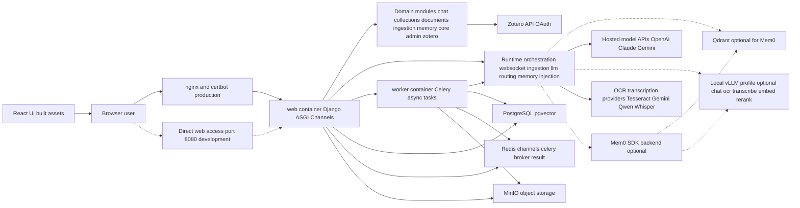
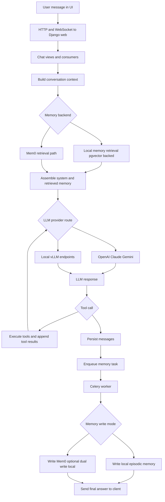
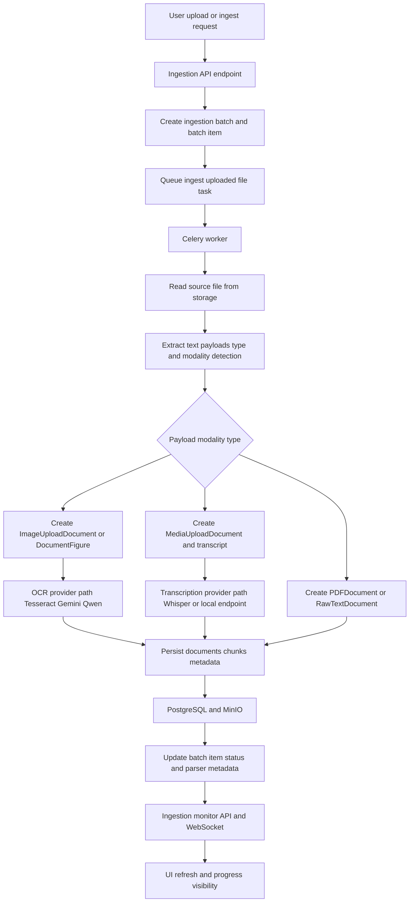
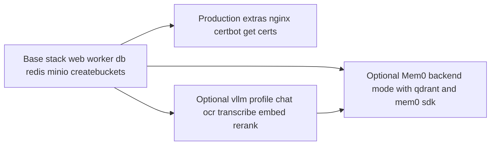

# AquiLLM Architecture (Mermaid)

This document captures the current architecture as implemented in the repository and compose configuration.

## 1) System Container View

## 2) Chat Request Runtime Flow

## 3) Unified Ingestion Runtime Flow

## 4) Deployment Profiles (compose-level)

## Notes

- Dashed nodes/edges represent optional or mode-dependent paths.
- React is built during web container startup and served as static assets through Django.
- WebSockets are handled by Channels (Redis channel layer). The ASGI stack registers `apps.chat.routing` and `apps.ingestion.routing` websocket patterns (alongside project-level crawl status routes) in `aquillm/asgi.py`.
- Celery worker handles asynchronous ingestion and memory-writing tasks.
