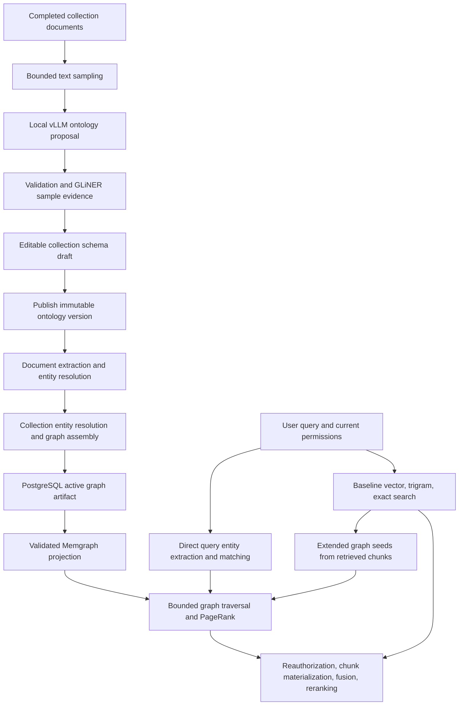

# Knowledge graph adversarial audit — 2026-09-21

Audited checkout: `cff1a17c171dac7e2ff9429758c06d6053f28167`.

Follow-up repairs and verification are recorded in [remediation.md](remediation.md).

The implementation contains strong provenance, permission, version, and publication checks, but several connections between those checks are defective. The highest priorities are an authorization fallback that returns revoked content, incompatible identifiers that prevent direct query seeds matching the graph, and schema-generation recovery after worker loss. This audit found **3 P1 and 9 P2 issues**. P1 means fix before relying on the affected feature; P2 means a concrete correctness, availability, or scale defect to schedule next.

This was a source audit with local deterministic reproductions, not an audit of the deployed service or its data. Hybrid retrieval findings apply when its feature flags are enabled. Application source was not changed; this directory contains the report and reproduction artifacts.

## How collection content becomes a queryable graph

The collection's “schema” is an extraction ontology: entity types, relation types, permitted endpoint types, directions, and extraction/retrieval policy. It does not generate new PostgreSQL table definitions or arbitrary query-time Cypher. PostgreSQL models and the Memgraph projection structure are fixed.

1. **Sampling and generation.** Collection documents are fingerprinted; sampling takes at most 32 chunks and 48,000 characters, distributed across a bounded deterministic document selection. Local vLLM proposes 2–24 entity types and 1–32 relation types, with one repair attempt. GLiNER sample evidence removes unsupported types/relations. This produces a draft, not an automatically published universal schema. See [schema_generation.py](../../../aquillm/apps/collections/services/schema_generation.py:18).
2. **Publication.** Validation, draft identity/revision checks, immutable history, and collection ontology activation establish the version used by rebuilds. A rebuild is scheduled after commit. Collections without an active custom ontology fall back to the deployment ontology. See [schema.py](../../../aquillm/apps/collections/services/schema.py:420).
3. **Extraction and assembly.** Persisted text chunks are extracted into grounded mentions and relations. Document and collection resolution merge identities, apply filtering, assemble supported edges, and bind artifacts to source/configuration fingerprints. A collection build requires an eligible document's graph artifact before including it in the manifest.
4. **Projection.** PostgreSQL remains authoritative. The worker encodes opaque identifiers, persists private chunk mappings, stages Memgraph records, validates checksums/counts, and publishes readiness through a compare-and-set operation. See [worker.py](../../../aquillm/apps/knowledge_graph/projection/worker.py:118).
5. **Querying.** The direct branch extracts query entities against the selected artifacts' ontology and resolves identifiers/names/aliases/embeddings. The extended branch derives graph seeds from initial vector chunks. Both feed bounded topology traversal/PageRank; results are mapped back to chunks, reauthorized, fused with baseline retrieval, and reranked. The direct branch explicitly declines mixed ontology selections; it does not synthesize a merged ontology for the query. See [production_direct.py](../../../aquillm/apps/knowledge_graph/retrieval/production_direct.py:38).

## Findings

### 1. P1 — Authorization failure falls back to revoked document content

**Trigger:** permissions change after the initial authorized document selection but before hybrid dependency setup. The dependency factory revalidates access, detects the changed scope, and returns `None`. The caller then retains the original baseline candidates and reranks them with `authorized_scope=None`, bypassing the reauthorization used by the normal hybrid path.

**Impact:** content from a document whose access has already been revoked can be returned, despite this request having detected the revocation. This is a permission-revocation race, not evidence that an arbitrary never-authorized document can be selected.

**Evidence:** the offline reproduction used the real authorization policy/context, dependency factory, resolver, and search function, with candidate retrieval/reranking mocked. It had zero currently authorized documents and still returned baseline chunk `[1]`.

**Repair:** distinguish authorization failure from backend unavailability. Reauthorize baseline candidates on every hybrid failure path and before returning/reranking content; return no protected content when authorization cannot be established.

References: [dependency revalidation](../../../aquillm/apps/documents/services/hybrid_graph_dependencies.py:106), [unfiltered fallback](../../../aquillm/apps/documents/services/chunk_search.py:330), [reranking without scope](../../../aquillm/apps/documents/services/chunk_search.py:350), [existing safe reauthorization helper](../../../aquillm/apps/documents/services/hybrid_graph_authorization.py:91).

### 2. P1 — Direct query seeds do not use the projected graph's identity keys

There are two independent mismatches:

- For entities without canonical membership, query matching HMACs the entity ID with an **already encoded generation digest**. Projection encoding uses the **original generation UUID**.
- For canonical entities, query matching HMACs `CanonicalEntity.identity_key` as a string. Projection membership encoding uses the canonical entity's **integer database primary key**.

**Impact:** both identity modes produce seeds that do not match the intended projected nodes. Successful query extraction/name matching cannot yield the expected direct graph traversal. Baseline/extended retrieval may mask the defect.

**Evidence:** the actual direct repository and identifier codec returned mismatched keys for both identity modes in the deterministic probe. Existing repository unit tests pass because they do not compare this path against the production projection encoding inputs.

**Repair:** share one canonical encoding contract between projection and query resolution, carry the raw generation UUID internally, and use the same canonical identity source. Add a test that projects a small graph and resolves a real query seed into that graph.

References: [scope construction](../../../aquillm/apps/knowledge_graph/retrieval/production_direct.py:83), [query key construction](../../../aquillm/apps/knowledge_graph/retrieval/direct_seed_repository.py:177), [canonical SQL source](../../../aquillm/apps/knowledge_graph/retrieval/direct_seed_repository.py:259), [projection generation input](../../../aquillm/apps/knowledge_graph/projection/projection_encoding.py:28), [projection canonical source](../../../aquillm/apps/knowledge_graph/projection/projection_encoding.py:136).

### 3. P1 — A lost schema worker can leave generation permanently running

**Trigger:** a worker dies after claiming the ten-minute generation lease. Immediate redelivery encounters the live lease, returns normally, and acknowledges the delivery. Lease expiry does not itself schedule recovery. Generate requests reuse the existing active run without enqueuing it again.

**Impact:** schema generation remains “running” until manual recovery, and the active-run uniqueness rule prevents a replacement run.

**Evidence:** executing the actual task against a fake running row with nine minutes remaining left it running and made zero retry calls. The backfill management command offers manual recovery; no automatic expired-run recovery was found.

**Repair:** defer live-lease redeliveries instead of consuming them, and add durable expired-run recovery or safe API reclaim.

References: [live-lease rejection](../../../aquillm/apps/collections/tasks/schema_generation.py:78), [normal return](../../../aquillm/apps/collections/tasks/schema_generation.py:244), [API enqueue conditions](../../../aquillm/apps/collections/views/schema_api.py:151).

### 4. P2 — Committed ingestion can lose its graph build request

**Trigger:** broker publication fails after chunk replacement commits. The graph enqueue hook catches/logs the exception; chunking completes successfully. No durable graph-build intent has been created at that seam.

**Impact:** the document can remain ingested without its graph artifact. Since collection refresh requires the eligible document artifacts, one lost enqueue can block refreshing the collection graph until explicit rebuild/reingestion.

**Evidence:** code inspection and existing enqueue tests confirm swallowed publication failure. No live broker-outage test was run. Collection-refresh scheduling and schema-publication scheduling have similar best-effort callbacks.

**Repair:** persist graph-build intent transactionally and dispatch through an outbox, or reconcile ingested documents lacking their current build identity while preserving successful ingestion.

References: [post-chunk hook](../../../aquillm/apps/knowledge_graph/graph/invalidation.py:2219), [collection completeness requirement](../../../aquillm/apps/knowledge_graph/services/builds.py:4347), [schema publish callback](../../../aquillm/apps/collections/services/schema.py:499).

### 5. P2 — Publish validation permits names that downstream stages cannot handle

Manual schema validation accepts any nonempty type name. Both entity and relation names of 129 characters pass the ontology parser although their stored mention fields have a 128-character limit; the editor contract advertises 64. A valid relation named `entities` also collides with the GLiNER output envelope: normalization silently discards it with no diagnostic.

**Impact:** a schema can validate and become active but then fail persistence when its long type is extracted, or silently lose a permitted relation.

**Evidence:** actual parser/normalizer probes accept the overlength names and return zero relations/zero diagnostics for `entities`. The persistence limit was verified against model definitions; an actual PostgreSQL insertion was not attempted.

**Repair:** enforce a shared bounded naming contract, including reserved provider keys, before publication. Apply it to generated and manually edited schemas.

References: [weak name validation](../../../aquillm/apps/knowledge_graph/services/ontology.py:208), [entity field](../../../aquillm/apps/knowledge_graph/models/entities.py:62), [relation field](../../../aquillm/apps/knowledge_graph/models/relations.py:55), [reserved-key skip](../../../aquillm/lib/knowledge_graph/extractors/gliner2_local.py:458).

### 6. Resolved P2 — Valid undirected relations were discarded in reverse orientation

Provider normalization and extraction mapping now evaluate both jointly valid endpoint orientations for undirected relations with asymmetric endpoint type sets. They preserve the extractor's accepted orientation, while directed relations still require head → tail.

**Impact:** graph completeness no longer depends on the extractor's arbitrary endpoint order when the published schema says the relationship is undirected.

**Evidence:** regression tests cover forward and reverse undirected provider output, direct pipeline mapping, invalid endpoint types, directed reverse rejection, and ambiguous grounding. The offline extraction probe now requires one relation with no diagnostic in both orientations.

**Repair:** completed by resolving each allowed orientation as a pair and accepting only an orientation whose two endpoints ground uniquely.

References: [provider normalization](../../../aquillm/lib/knowledge_graph/extractors/gliner2_local.py), [pipeline mapping](../../../aquillm/apps/knowledge_graph/extraction/pipeline.py), [assembly](../../../aquillm/apps/knowledge_graph/graph/assembly.py).

### 7. P2 — A stale schema editor can overwrite a replacement draft

Definition PUT/DELETE operations identify the current draft by collection and check only numeric revision. Replacing/restoring a draft creates a new UUID at revision 1. A stale tab holding the previous draft's revision 1 can therefore mutate the replacement without a conflict.

**Impact:** restored or newly generated schema edits can be silently overwritten/deleted by an older editor session.

**Evidence:** the real mutation service accepted a stale revision-1 request against a replacement draft, overwrote its description, and advanced it to revision 2.

**Repair:** require draft UUID plus revision for every mutation, matching the identity fencing already used by publication/discard/generation.

References: [revision-only lock](../../../aquillm/apps/collections/services/schema.py:257), [mutation API](../../../aquillm/apps/collections/views/schema_api.py:205), [replacement draft](../../../aquillm/apps/collections/services/schema.py:637).

### 8. P2 — Extended query preparation reloads the entire selected graph

For each selected collection, the extended branch loads the full PostgreSQL projection bundle, including documents/chunks/entities/relations/evidence/mentions, checksums it, then scans the mentions to find the handful of seed chunks. The repository also checksums the bundle during loading.

**Impact:** each query's seed preparation scales with whole selected collections, including collections without relevant seed chunks. Bounded traversal limits do not bound this preparation work. Deadline checks before/after loading do not interrupt the loading itself.

**Evidence:** production call-path inspection; no deployed latency benchmark was performed.

**Repair:** query only memberships/mentions for selected seed chunk keys using the ready generation as authority. Keep full graph attestation in projection publication/reconciliation, or cache immutable validated generations with appropriate authority checks.

References: [full-load loop](../../../aquillm/apps/knowledge_graph/retrieval/production_extended.py:107), [whole-family ORM reads](../../../aquillm/apps/knowledge_graph/projection/django_projection_rows.py:52), [additional checksum](../../../aquillm/apps/knowledge_graph/projection/postgres_repository.py:121).

### 9. Resolved P2 — One semantic resolution candidate triggered a Cartesian scan

Collection resolution now selects the first member of each sorted disjoint-set group and normalizes that single pair.

**Impact:** representative selection is constant per semantic candidate instead of quadratic in the sizes of its two resolved groups.

**Evidence:** a behavior and operation-count regression verifies the same minimum representative `(min(left_group), min(right_group))` while bounding total pair normalization linearly across repeated-label groups. The offline probe exercises groups of 100, 300, and 1,000 members.

**Repair:** completed using the deterministic sorted minima already guaranteed by disjoint-set group construction.

Reference: [representative selection](../../../aquillm/apps/knowledge_graph/resolution/collection.py).

### 10. P2 — Reconciliation leaves its newly created outbox work unpublished

The reconciliation task publishes existing due outbox rows **before** reconciling. Reconciliation can then create new project/prune rows, but the task returns without another publish or continuation. Management reconciliation similarly records work without dispatching it.

**Impact:** a single recovery invocation against missing/drifted projections can report work enqueued while leaving it pending until another invocation or an independently configured dispatcher runs. A fixed single publish page also leaves larger backlogs pending.

**Evidence:** actual task orchestration with fake broker/store boundaries returned `enqueued_count=1`, `published_count=0`, with the new row still pending. No default periodic projection dispatcher was found in the inspected configuration.

**Repair:** preserve the initial flush, then dispatch newly created work and schedule bounded continuation for any remaining backlog, or configure a dedicated recurring outbox dispatcher.

References: [publish-before-reconcile ordering](../../../aquillm/apps/knowledge_graph/projection/tasks.py:94), [replay inserts pending work](../../../aquillm/apps/knowledge_graph/migrations/0008_projection_worker_state_api.py:105).

### 11. P2 — Projection version changes abort reconciliation instead of rebuilding

Reconciliation selects a ready projection without filtering its format/schema/key version, then loads it through a source configured for the current runtime versions. The source rejects the old version before the auditor can return a replay reason; the exception escapes the reconciliation loop.

**Impact:** changing projection schema/format or identifier key version can prevent the reconciliation command from migrating existing ready collections. One incompatible row can abort a multi-collection run.

**Evidence:** the actual auditor and row-source validation with an old ready schema and a new configured schema raised `Django projection version is stale`, rather than returning a replay condition.

**Repair:** compare authority versions before decoding the old bundle and explicitly supersede/replay incompatible versions; keep independent collections progressing when a recoverable mismatch occurs.

References: [unversioned selection](../../../aquillm/apps/knowledge_graph/projection/reconciler.py:100), [uncaught source load](../../../aquillm/apps/knowledge_graph/projection/generation_audit.py:100), [source version rejection](../../../aquillm/apps/knowledge_graph/projection/django_projection_source.py:112).

### 12. P2 — Bulk pruning repeatedly selects already-deleted generations

Bulk pruning selects the first fixed page of terminal PostgreSQL authority rows. Deleting the Memgraph generation neither removes nor marks those authority rows, and the API has no cursor for moving past them.

**Impact:** repeated maintenance calls revisit the same empty generations and can leave later generations unpruned indefinitely unless another action changes the authority rows. A full candidate page also suppresses orphan scanning.

**Evidence:** actual pruning orchestration with a two-row terminal source and page size one deleted the first generation, then revisited it on the next call; the second remained. The unchanged authority query and lack of a prune marker/cursor were checked in source. PostgreSQL ranking itself was not integration-tested.

**Repair:** persist deletion completion or advance through terminal authority using stable pagination while preserving retention and audit history.

References: [fixed first-page selection](../../../aquillm/apps/knowledge_graph/projection/reconciler.py:203), [deletion-only execution](../../../aquillm/apps/knowledge_graph/projection/reconciler.py:274).

## Explicit limits and positive controls

- The 32-chunk/48,000-character sample and generated type-count caps are deliberate. They cannot establish exhaustive schema coverage for large or heterogeneous collections. Evidence on that sample validates extraction support, not the factual truth or completeness of an ontology.
- Projection loading has a separate **4,999-row hard ceiling per family**, including chunks and entities. This is a collection projection limit, not merely a batching setting. Collections exceeding it fail projection; increasing the batch-size setting does not remove the ceiling. See [row bound](../../../aquillm/apps/knowledge_graph/projection/django_projection_rows.py:22).
- Mixed published ontologies deliberately disable direct query extraction for that selection. Baseline and the extended branch remain the alternative paths, subject to readiness and their own failures.
- Immutable artifacts, input manifests, activation checks, grounded span validation, fixed parameterized topology operations, private ID reversal, and repeated authorization checks are useful defenses. The findings above identify specific gaps in how those mechanisms connect; they do not establish that every protection is ineffective.

## Verification and reproduction

**155 existing focused tests passed**, with one Django/database-dependent test deselected. Separately, **three projection audit reproductions passed**, and all offline query, schema, and extraction probes reproduced the reported defects. These audit probes intentionally assert the current defective behavior; passing them is not a clean bill of health.

- 27 existing projection task/reconciler/runtime tests passed.
- 128 existing direct-repository, hybrid dependency/authorization, span mapping, collection resolution, graph enqueue, and schema generation/hardening tests passed; one deselected.
- Offline probes: [query_probes.py](./query_probes.py), [schema_probes.py](./schema_probes.py), [extraction_probes.py](./extraction_probes.py).
- Projection probes: [test_projection_audit_probes.py](./test_projection_audit_probes.py).

Run the three standalone scripts with `rtk proxy python <script-path>` from the repository root. The pytest runs used system Python with test-only credentials and offline Hugging Face mode; the repository virtual environments lacked pytest. No real API credentials were read or used.

Not performed: live PostgreSQL insertion/race tests, Celery worker-kill/broker-outage tests, a live GLiNER/vLLM evaluation, Memgraph integration, deployed permission tests, or corpus-level precision/recall/latency measurements. Findings based only on inspection are labeled above; fake boundaries in the reproductions are documented in the scripts.

**Recommended repair order:** close the authorization fallback; unify query/projection identifiers and add a small production-path integration test; repair schema/task recovery; enforce publish-time naming and relation semantics; then address graph preparation/resolution costs and projection maintenance. Add regression coverage at the component boundaries, since many current component tests pass while those boundaries disagree.
