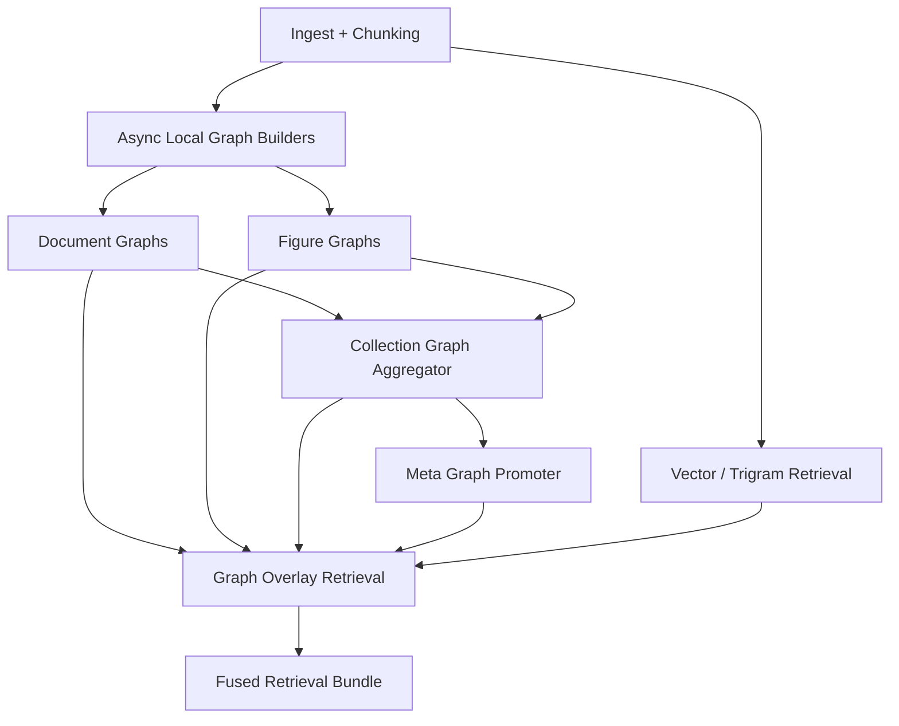

# Knowledge Graph Index Overlay Design

**Date:** 2026-04-09  
**Status:** Draft  
**Goal:** Add a graph-as-index overlay over AquiLLM's current chunk/vector retrieval so document, figure, collection, and cross-collection relationships improve RAG quality without replacing the existing vector pipeline.

## Overview

AquiLLM already has the right substrate:

- documents and figures in `apps.documents`
- collections in `apps.collections`
- chunking in `apps.documents.tasks.chunking`
- hybrid retrieval in `apps.documents.services.chunk_search`

The new graph system should sit on top of that substrate asynchronously. The graph is an overlay, not a second ingestion pipeline and not a separate source of truth.

The approved shape is hybrid:

- each document gets a local document graph
- each figure gets a local figure graph
- each collection gets a collection graph that merges repeated concepts within that collection
- a larger meta graph promotes high-confidence canonical concepts across collections

Every promoted node and edge keeps provenance links back to local graph evidence such as chunk IDs, figure IDs, captions, OCR text, and collection context.

## Principles

1. Graph-as-index overlay: vector retrieval stays primary and graph logic improves ranking, expansion, deduplication, and pruning.
2. Async by default: graph construction runs after chunking completes.
3. Local-first, meta-second: local graphs produce evidence; collection and meta graphs only promote supported concepts.
4. Provenance required: graph facts must always trace back to source evidence.
5. Rebuildable lifecycle: re-ingest, delete, move, and collection changes must invalidate and rebuild safely.
6. Fail-open retrieval: if graph state is unavailable, current retrieval still works.

## Goals

1. Build a complete lifecycle for association, promotion, deduplication, pruning, and rebuild.
2. Improve retrieval for multi-hop, synonym-heavy, and figure-grounded questions.
3. Keep the current chunk search and tool interfaces compatible.
4. Respect collection scoping and existing permissions.
5. Provide operator-visible state for build runs, stale graphs, and pruning behavior.

## Non-Goals

1. Replacing `TextChunk` vector retrieval.
2. Adding an external graph database in the first pass.
3. Shipping graph visualization UI in the first pass.

## Runtime Model

Retrieval remains chunk-centric:

1. vector/trigram search finds seed chunks
2. graph overlay maps those chunks to graph evidence
3. bounded expansion walks local, collection, and meta relations
4. scoring fuses vector rank with graph support
5. weak, stale, or duplicate paths are pruned
6. the result stays compatible with the current answer pipeline

## Persistence Model

The first pass should live in the existing Django/Postgres stack beside `TextChunk`, with a dedicated app:

- `aquillm/apps/knowledge_graph/`

Recommended core models:

1. `GraphArtifact`
   Represents one graph scope and version.
   Fields should include `scope_type`, `scope_id`, nullable `collection`, `status`, `source_hash`, and `version`.

2. `GraphNode`
   Stores local and canonical nodes.
   Fields should include `artifact`, `node_key`, `kind`, `label`, `normalized_label`, `summary`, `confidence`, `metadata`, and optional `embedding`.

3. `GraphEdge`
   Stores directional relations.
   Fields should include `artifact`, `source_node`, `target_node`, `relation`, `normalized_relation`, `weight`, `confidence`, `status`, and `metadata`.

4. `GraphEvidence`
   Connects nodes and edges to source evidence.
   Fields should include `artifact`, nullable `node`, nullable `edge`, `document_id`, nullable `figure_id`, nullable `chunk_id`, `evidence_text`, `evidence_kind`, `confidence`, and `metadata`.

5. `GraphAssociation`
   Connects local nodes to collection or meta canonical nodes.
   Fields should include `source_node`, `target_node`, `association_type`, `score`, and `metadata`.

6. `GraphBuildRun`
   Tracks async work and operator visibility.
   Fields should include `artifact`, `trigger`, `status`, `started_at`, `finished_at`, `stats`, and `error`.

## Lifecycle

### Local builds

After `create_chunks` succeeds for a document:

1. queue a document graph build
2. queue figure graph builds for related `DocumentFigure` artifacts when applicable
3. activate the new local artifact and supersede older ones

### Collection refresh

When a local graph becomes active:

1. mark the owning collection graph stale
2. rebuild the collection graph asynchronously
3. merge repeated concepts inside that collection while keeping explicit provenance links

### Meta promotion

When a collection graph becomes active:

1. evaluate candidate nodes and edges for promotion
2. promote only sufficiently supported concepts
3. persist canonical nodes and edges in the meta artifact
4. preserve `GraphAssociation` links back to collection and local concepts

### Invalidation and rebuild

If a document changes, moves collections, or is deleted:

1. local artifacts become `stale` or `superseded`
2. affected collection graphs are queued for refresh
3. dependent meta associations are re-evaluated
4. retrieval automatically ignores superseded artifacts

## Deduplication and Pruning

Deduplication should happen in layers:

1. deterministic local dedupe
   Normalize labels and relations, collapse exact duplicates, reject self-loops and empty relations.

2. collection-level semantic dedupe
   Merge naming variants and repeated concepts inside one collection with bounded similarity rules.

3. conservative meta canonicalization
   Promote aliases and stable canonical nodes without over-merging distinct concepts.

Pruning should be routine lifecycle maintenance:

- remove unsupported edges
- remove orphan nodes created by pruned edges
- suppress degenerate hub nodes
- retire superseded artifacts beyond retention policy
- keep everything rebuildable from source evidence

## Retrieval Overlay

The overlay should run inside `apps.documents.services.chunk_search` after the current seed retrieval:

1. map seed chunks to `GraphEvidence`
2. expand through active graph nodes and associations with hard hop and fan-out limits
3. score graph-supported chunks, figures, and documents
4. fuse graph support with existing vector/trigram rank
5. fail open to current behavior if overlay work errors or times out

The first pass can remain backward-compatible with current tool payloads and optionally attach graph-support metadata for debugging.

## Async Tasks and Operations

Recommended Celery tasks:

- `build_document_graph`
- `build_figure_graph`
- `refresh_collection_graph`
- `refresh_meta_graph`
- `prune_graph_overlay`
- `rebuild_graph_overlay`

Recommended operator controls:

- management command to rebuild one document, one collection, or the whole overlay
- management command to prune stale or weak graph state
- durable `GraphBuildRun` rows for debugging failed or stale work

## Suggested Config

- `KG_OVERLAY_ENABLED`
- `KG_OVERLAY_LOCAL_ENABLED`
- `KG_OVERLAY_COLLECTION_ENABLED`
- `KG_OVERLAY_META_ENABLED`
- `KG_OVERLAY_MAX_HOPS`
- `KG_OVERLAY_MAX_EXPANSIONS`
- `KG_OVERLAY_PROMOTION_MIN_SCORE`
- `KG_OVERLAY_DEDUPE_MIN_SCORE`
- `KG_OVERLAY_PRUNE_ENABLED`
- `KG_OVERLAY_FAIL_OPEN`

## Mem0 Integration Notes

This overlay should be designed to coexist with the current Mem0 integration rather than compete with it.

Possible integration paths to explore:

1. keep Mem0 focused on episodic and user-memory use cases, while the new overlay handles document, figure, collection, and meta knowledge over the RAG corpus
2. reuse normalization, relation filtering, and graph-quality heuristics already developed for Mem0 graph memory where those rules also improve document-graph quality
3. expose graph-overlay evidence as an optional retrieval input to Mem0-backed workflows, rather than duplicating the same graph extraction logic in both systems
4. compare whether canonical entity matching or graph-quality filters belong in a shared library under `aquillm/lib/memory` or in a new shared graph utility layer that both Mem0 and the overlay can call
5. keep storage and lifecycle boundaries explicit: Mem0 remains conversation and memory oriented, while the overlay remains corpus and retrieval oriented unless later evidence supports deeper convergence
6. explore a promotion path where stable, repeatedly supported corpus facts from the overlay can inform Mem0 durable memory, so the system's total usable knowledge can grow over time instead of being limited to one retrieval pass

If this promotion path is explored later, it should be conservative and evidence-driven:

- only promote facts that survive deduplication and pruning
- require repeated support across documents, figures, collections, or time
- preserve provenance back to overlay evidence
- avoid polluting Mem0 with transient, low-confidence, or corpus-local noise

The first implementation pass should avoid tightly coupling the two systems. A better near-term goal is compatibility, shared heuristics where useful, and clear boundaries so future convergence is possible without forcing it early.

## Success Criteria

The overlay is successful when:

1. document and figure graphs build automatically after ingest
2. collection and meta graphs stay traceable to source evidence
3. duplicate concepts are merged more cleanly within collections
4. stale or weak relations are pruned without breaking retrieval
5. graph-assisted retrieval improves relationship-heavy search quality
6. vector retrieval keeps working when graph state is missing or rebuilding
