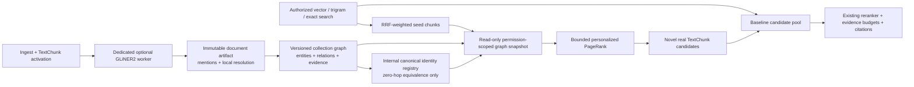

# Knowledge Graph Index Overlay Design

**Originally proposed:** 2026-04-09

**Updated:** 2026-08-18

**Status:** implemented behind disabled rollout flags; measured gates pending

**Goal:** improve relationship-heavy RAG with a provenance-first collection
graph and permission-safe cross-collection identity spine, without replacing
AquiLLM's hybrid retrieval or changing its public evidence contract.

## Decision summary

The overlay is a rebuildable PostgreSQL index over existing documents,
`TextChunk` rows, figures, and collections. It has four layers:

1. immutable entity and relation mentions tied to exact chunk spans;
2. versioned document artifacts that resolve local mention identity;
3. versioned collection graphs that promote supported entities and relations;
4. a deployment-wide canonical identity registry that links equivalent
   collection entities without moving their claims or permissions.

Existing vector, trigram, and exact retrieval remains primary. Its ranked chunks
form a deterministic reciprocal-rank-fusion restart vector. A bounded
personalized PageRank (`ppr_v1`) runs only over the caller's already-authorized
active graph slice, projects support back to real chunks, and adds those chunks
to the existing candidate pool before the existing reranker.

This design supersedes the earlier “meta graph” proposal. There is no promoted
deployment-wide claims graph in v1. The cross-collection spine contains identity
only; relation claims and evidence remain collection-owned.

## Architecture


```mermaid
flowchart LR
    A["Ingest + TextChunk activation"] --> B["Dedicated optional GLiNER2 worker"]
    B --> C["Immutable document artifact<br/>mentions + local resolution"]
    C --> D["Versioned collection graph<br/>entities + relations + evidence"]
    D --> E["Internal canonical identity registry<br/>zero-hop equivalence only"]

    F["Authorized vector / trigram / exact search"] --> G["RRF-weighted seed chunks"]
    G --> H["Read-only permission-scoped graph snapshot"]
    D --> H
    E --> H
    H --> I["Bounded personalized PageRank"]
    I --> J["Novel real TextChunk candidates"]
    F --> K["Baseline candidate pool"]
    J --> K
    K --> L["Existing reranker + evidence budgets + citations"]
```

The graph is asynchronous and fail-open. Extraction or graph availability never
blocks chunk activation, baseline search, reranking, or answer generation.

## Design principles

1. **Graph as index, not source of truth.** Documents and chunks remain the
   authoritative corpus. Every graph artifact can be rebuilt from them.
2. **Provenance before promotion.** Promoted entities and relations retain exact
   active mention/document/chunk evidence and immutable build identities.
3. **Collection-owned claims.** Canonical identity never creates a global claim,
   relation, chunk, label listing, or access grant.
4. **Permission first.** Retrieval starts from the exact authorized document and
   collection tuples and repeats those predicates on every endpoint/evidence
   query. Hidden nodes are never loaded and filtered later.
5. **Deterministic versions.** Ontology, extractor, resolver, filter, assembly,
   embedding, and retrieval-algorithm identities are checksum-addressed.
6. **Atomic lifecycle.** Build outputs are immutable, activation swaps are
   atomic, and readers see one repeatable-read snapshot or a graph miss.
7. **Bounded inference.** Scope, seeds, nodes, edges, evidence, mentions, hops,
   fan-out, candidates, iterations, and total time have explicit ceilings.
8. **Public compatibility.** Only real, authorized chunks enter existing
   reranking/evidence/citation paths. Graph internals are never citable rows.

## Persistence model

All state lives in `apps.knowledge_graph` in the existing Django/PostgreSQL
database. No external graph database is required.

### Lifecycle and immutable inputs

- `GraphArtifact` identifies one document or collection build occurrence and
  pins source, ontology, extractor, resolver, filter, assembly, and embedding
  identities plus lifecycle timestamps.
- `GraphBuildRun` records leased staged execution, terminal outcomes, and bounded
  operational audit without storing sensitive extraction output in logs.
- `GraphRebuildRequest` provides durable, idempotent document, collection, and
  operator-wide rebuild orchestration. Terminal success keeps an immutable
  scalar artifact/run occurrence audit without an artifact foreign key, so
  retention can prune the terminal occurrence without erasing the audit.
  Concurrent scope drift is reconciled under the same request identity; bounded
  partial outcomes remain explicitly resumable instead of silently widening the
  captured scope.
- `CollectionArtifactInput` is the exact manifest of document artifacts used to
  assemble a collection artifact.
- `OntologyVersion` stores checksum-addressed provider-neutral YAML. Draft or
  rejected versions cannot become build inputs.

### Extraction and local resolution

- `EntityMention` stores validated half-open spans and extraction evidence.
- `RelationMention` stores typed, directed mention evidence with exact head/tail
  endpoints and chunk provenance.
- `DocumentEntity` resolves local coreference/identity without automatically
  merging pronoun-only references.
- `DocumentEntityMention` binds resolved document entities to their mentions and
  records structured alias/acronym provenance.

Raw evidence is retained when a candidate is suppressed or rejected. Provider
objects and mutable model payloads are not persistence contracts.

### Collection graph

- `CollectionEntity` is the collection-owned promoted identity.
- `CollectionEntityDocumentLink` proves the active automatic document membership
  that gives a collection entity its permission-bearing source boundary.
- `CollectionRelation` stores collection-owned semantic relations.
- `CollectionRelationEvidence` binds a relation to active authorized source
  provenance. Support and confidence are recomputed from selected evidence at
  retrieval time rather than trusting a wider aggregate.

A collection graph is assembled from one exact pinned document manifest. It
merges repeated concepts conservatively within that collection and never copies
claims into another collection.

### Cross-collection canonical spine

- `CanonicalEntity` is an internal stable registry identity with no documents,
  chunks, relations, claims, labels exposed to users, or permission grants.
- `CanonicalEntityLink` is an audited collection-entity-to-canonical decision
  containing method, score, resolver version, outcome/reason, and checksum.

Automatic cross-collection identity is allowed only for:

- identical canonical stable identifiers with exact compatible type/version;
- an exact normalized name or proven declared alias with no conflicting stable
  identifiers or versions;
- a resolver-proven defined acronym whose unique local full form is identical.

Whole-component conflict checks prevent a transitive identifier, type, version,
or acronym bridge. Embedding similarity may propose a reviewable candidate but
is never automatic. Corrected resolution supersedes audited decisions and
reconciles the whole affected component so a removed bridge can split unchanged
peers without recreating stable registry primary keys.

Canonical links are zero-semantic-hop equivalence bridges. During retrieval,
authorized linked copies collapse into one private identity supernode so copies
do not multiply restart mass or relation weight. Unauthorized copies never
enter the snapshot and cannot affect counts, diagnostics, or rank.

## Build and invalidation lifecycle

### Document build

After chunk replacement commits:

1. ingestion publishes a document build only after the complete new chunk set
   is active;
2. the optional worker extracts bounded entity/relation mentions;
3. local coreference, entity resolution, and policy filtering run as separate
   versioned stages;
4. the immutable document artifact activates atomically;
5. affected collection refresh requests publish after commit.

Figures use typed database-backed ownership and participate as document-scoped
source artifacts. v1 does not add a separate figure/meta graph layer.

### Collection refresh

The collection builder:

1. selects the exact active document-artifact manifest available for the
   collection;
2. pins that manifest, ontology, resolver/filter configuration, embedding
   identity, and source hash;
3. assembles entities, memberships, relations, and evidence in a building
   artifact;
4. atomically activates the complete collection artifact and supersedes the old
   occurrence;
5. schedules canonical-registry reconciliation after commit.

An active collection artifact remains readable through its exact pinned
document manifest while a replacement document/collection build is in flight.
New collection assembly still selects current active document inputs only.

### Content, move, and deletion

Rechunking, document move, typed figure ownership changes, and document or
collection deletion use one lifecycle lock order. Obsolete permission-bearing
graph rows are synchronously terminalized or removed where database integrity
requires it; rebuild publication happens after commit. Moving a document
refreshes both old and new collection scopes. Source deletion can cascade only
through derived graph provenance and cannot leave active evidence.

## Retrieval overlay

### Seed acquisition

`collect_hybrid_candidate_snapshot` is the single vector/trigram/exact
acquisition seam used by production and evaluation. It preserves baseline
first-occurrence ordering and produces normalized positive restart weights:

```text
seed_weight(chunk) = sum(1 / (RRF_K + one_based_source_rank))
```

Raw vector distance, trigram similarity, and exact-match flags are not mixed
because their scales are provider-specific. The already-authorized document
snapshot supplies both baseline queries and the graph request.

### Authorized graph snapshot

The loader opens one new PostgreSQL read-only repeatable-read transaction with a
transaction-local timeout. It validates exact authorized document/collection
tuples, real seed chunks, current artifacts, pinned manifests, active mappings,
canonical links, relations, and evidence. Every query is bounded before Python
materialization and repeats authorization predicates on both endpoints.

Cross-collection traversal occurs only by collapsing currently authorized
collection entities connected to the same active canonical registry row.
Canonical crossing consumes zero semantic hops but grants no new scope.

### Personalized PageRank

For the bounded induced graph:

1. seed weights are split across distinct mapped identity supernodes and
   normalized once;
2. each physical relation derives weight from its own active authorized
   confidence, support, destination utility, and direction factor;
3. canonical copies are grouped by maximum physical weight, not summed;
4. fan-out and global node/edge caps apply in stable hop order;
5. `ppr_v1` runs a fixed eight iterations with restart `0.20`;
6. selected relation evidence and bounded fallback mentions project scores back
   to real chunks;
7. seed chunks and duplicates are removed before per-document/total candidate
   caps;
8. novel chunks join the baseline pool before the existing reranker.

Directed claims receive a full forward retrieval transition and a lower-weight
reverse retrieval transition; the latter helps discovery but does not assert an
inverse fact. Ontology-declared undirected relations use equal reciprocal
transitions. The exact ontology version/checksum pinned by each artifact
determines direction.

The overlay emits only privacy-safe internal diagnostics: timing, seed/candidate
counts, `hit|miss|timeout|error`, and opaque lowercase SHA-256 algorithm/version
signatures. Public tool payloads strip those fields and retain existing real
chunk citation shapes.

## Operations and rollout

Builds and retrieval ship independently disabled. The required immutable model
check, representative collection backfill, inspection commands, one-snapshot
vector/one-hop/PPR comparison, numeric gates, staged enablement, rollback order,
retention exceptions, and ownership rules are defined in the
[knowledge graph overlay runbook](../operations/knowledge-graph-overlay-runbook.md).

No production enablement is valid while a measured gate is pending or failing.
Effective RRF/PPR/cap/version changes alter the algorithm signature and require a
new comparison and approval.

## Mem0 boundary

Mem0 remains focused on conversation and user-memory use cases. This overlay is
corpus- and retrieval-oriented. They may share an embedding endpoint or future
provider-neutral heuristics, but they do not share identity, permissions,
storage, lifecycle, canonical claims, or automatic promotion in v1.

## v1 non-goals

- replacing vector/trigram/exact retrieval or the existing reranker;
- an external graph database or shared retrieval cache;
- user-visible graph browsing or visualization;
- a user-enumerable global canonical graph;
- automatic ontology generation or activation;
- pronoun-only automatic identity merging;
- embedding-similarity automatic canonical linking;
- extraction, LLM calls, or network access at inference time;
- graph triples, scores, or pseudo-evidence in tool payloads or citations;
- automatic promotion between the corpus overlay and Mem0.

## Success criteria

The v1 design succeeds when:

1. graph building is asynchronous, idempotent, versioned, and independently
   switchable from retrieval;
2. every active entity/relation and returned chunk has exact source provenance;
3. collection claims stay collection-owned while authorized canonical peers can
   support cross-collection retrieval;
4. deterministic bounded PPR improves approved relationship, alias,
   cross-document, and cross-collection cases over the same baseline snapshot;
5. no inaccessible chunk or hidden graph state affects results or diagnostics;
6. graph miss/error/timeout preserves baseline retrieval and public citations;
7. lifecycle inspection, rollback, and conservative pruning are operator-safe;
8. all measured gates pass before production retrieval is enabled.
