# AquiLLM knowledge graph and retrieval pipeline

**Development branch reference · updated 29 September 2026**

This document describes the implementation at development commit [`9518c6d51b74d163d594de29ec3a8764a63f56c3`](https://github.com/AquiLLM/AquiLLM/tree/9518c6d51b74d163d594de29ec3a8764a63f56c3), verified against `origin/development` on the date above. Code links are pinned to that commit. The September 29 update includes the deployed chat, ingestion and background-recovery repairs. Retrieval-profile values below remain attributed to the checked-in rollout note; they are not a new measurement of effective environment flags or retrieval quality. The dated filename is retained so existing links continue to work.

AquiLLM builds reusable graph indexes in the background, then uses them alongside ordinary passage search when answering questions. The graph helps discover connected evidence; passage reranking and evidence selection decide what reaches the answer model. The final answer is grounded in document passages with citation identifiers.

## The complete flow



[Open the full-size diagram](2026-09-28-knowledge-graph-and-retrieval-pipeline.svg) · [Editable Mermaid source](2026-09-28-knowledge-graph-and-retrieval-pipeline.mmd)

Solid arrows show processing dependencies. Dashed arrows show reuse of stored indexes, ontology and provenance, or background work that does not gate answer delivery. The diagram shows the hybrid path with **adaptive evidence selection enabled**. Direct and extended graph search each run their own PageRank computation; either branch can contribute candidates independently. Legacy and preservation modes are explained below.

## 1. Build the graph before questions arrive

### Ingest and prepare passages

A document's text and hash identify its current content. Saving changed content records a `ChunkPublication` intent in the same transaction as the document, keyed by concrete model, database key, document UUID and content hash. Post-commit dispatch invalidates/reconciles derived state and publishes chunk work; a broker failure leaves durable intent for retry. Chunking creates overlapping `TextChunk` records, obtains embeddings, replaces the previous chunk set atomically, and then schedules graph construction. Successful chunk persistence acknowledges the matching intent. The application fallback chunk settings are **2,048 characters with 384 characters of overlap**; these are character counts, not token counts. [Document lifecycle](https://github.com/AquiLLM/AquiLLM/blob/9518c6d51b74d163d594de29ec3a8764a63f56c3/aquillm/apps/documents/models/document.py) · [Chunking and embedding](https://github.com/AquiLLM/AquiLLM/blob/9518c6d51b74d163d594de29ec3a8764a63f56c3/aquillm/apps/documents/tasks/chunking.py) · [Chunk defaults](https://github.com/AquiLLM/AquiLLM/blob/9518c6d51b74d163d594de29ec3a8764a63f56c3/aquillm/aquillm/apps.py#L89)

The dedicated application maintenance scheduler checks due chunk-publication intents every 60 seconds, normally up to 25 per run. Failed publication backs off between 30 and 900 seconds; a 15-minute publication lease makes abandoned deliveries eligible again. This is at-least-once delivery: existing source checks and lifecycle locks guard committed chunks, while a stalled worker can still cause repeated provider work. The chunk-publication outbox is separate from the graph-projection outbox below. [Chunk publication and recovery](https://github.com/AquiLLM/AquiLLM/blob/9518c6d51b74d163d594de29ec3a8764a63f56c3/aquillm/apps/documents/services/chunk_publication.py) · [Application schedules](https://github.com/AquiLLM/AquiLLM/blob/9518c6d51b74d163d594de29ec3a8764a63f56c3/aquillm/aquillm/celery_schedules.py)

Graph work runs asynchronously through a dedicated Celery queue. Build requests carry source, ontology and configuration identities so workers can recognize the exact version they are building. A query can therefore use ordinary chunks while a graph build is still pending. [Post-commit graph enqueue](https://github.com/AquiLLM/AquiLLM/blob/9518c6d51b74d163d594de29ec3a8764a63f56c3/aquillm/apps/knowledge_graph/graph/invalidation.py#L2205) · [Build request preparation](https://github.com/AquiLLM/AquiLLM/blob/9518c6d51b74d163d594de29ec3a8764a63f56c3/aquillm/apps/knowledge_graph/services/builds.py#L2220)

### Use an ontology to tell GLiNER2 what to extract

The ontology defines the allowed entity types, relationship types and their descriptions. A collection can have its own active ontology; otherwise, lookup falls back to the active deployment ontology. GLiNER2 receives a schema built from that ontology and extracts typed entity and relationship mentions from the document chunks. The local extractor's default model is `fastino/gliner2-base-v1`, with a pinned model revision. [Ontology lookup](https://github.com/AquiLLM/AquiLLM/blob/9518c6d51b74d163d594de29ec3a8764a63f56c3/aquillm/apps/knowledge_graph/services/ontology.py#L721) · [GLiNER2 schema construction](https://github.com/AquiLLM/AquiLLM/blob/9518c6d51b74d163d594de29ec3a8764a63f56c3/aquillm/lib/knowledge_graph/extractors/gliner2_local.py#L418) · [Extractor defaults](https://github.com/AquiLLM/AquiLLM/blob/9518c6d51b74d163d594de29ec3a8764a63f56c3/aquillm/lib/knowledge_graph/config_defaults.py#L8)

Schema generation is a separate workflow: it samples collection content and produces a **draft**. Publishing a validated draft activates a collection ontology version and schedules rebuilding. Asking a normal retrieval question reuses the active ontology and existing graph. [Draft generation](https://github.com/AquiLLM/AquiLLM/blob/9518c6d51b74d163d594de29ec3a8764a63f56c3/aquillm/apps/collections/tasks/schema_generation.py#L180) · [Schema publication](https://github.com/AquiLLM/AquiLLM/blob/9518c6d51b74d163d594de29ec3a8764a63f56c3/aquillm/apps/collections/services/schema_publication.py#L126)

### Resolve mentions into document, collection and canonical identities

The build has three levels:

| Level | What it represents | Why it exists |
|---|---|---|
| Document graph | Entities and relations extracted from one exact document version, with source mentions | Connect repeated mentions while retaining their supporting chunks. |
| Collection graph | A versioned assembly of compatible active document graphs in a collection | Resolve identities across documents, filter candidates, and assemble supported relations. |
| Canonical registry | Shared identity links derived from active collection entities and verified provenance | Recognize compatible identities across collections without granting access to those collections. |

Extraction happens outside the SQL transaction. Before storing results, the worker rechecks source content, chunk identity, ontology and its build lease. Document activation and collection activation also recheck their inputs. Collection assembly waits for the required current document artifacts with the matching ontology, then resolves, filters, assembles, validates and activates its own artifact. [Extraction and persistence](https://github.com/AquiLLM/AquiLLM/blob/9518c6d51b74d163d594de29ec3a8764a63f56c3/aquillm/apps/knowledge_graph/extraction/pipeline.py#L1060) · [Document build stages](https://github.com/AquiLLM/AquiLLM/blob/9518c6d51b74d163d594de29ec3a8764a63f56c3/aquillm/apps/knowledge_graph/services/builds.py#L3805) · [Collection inputs](https://github.com/AquiLLM/AquiLLM/blob/9518c6d51b74d163d594de29ec3a8764a63f56c3/aquillm/apps/knowledge_graph/services/builds.py#L4055) · [Collection build stages](https://github.com/AquiLLM/AquiLLM/blob/9518c6d51b74d163d594de29ec3a8764a63f56c3/aquillm/apps/knowledge_graph/services/builds.py#L4726)

Canonical reconciliation derives identity decisions from exact source membership and mention provenance. It runs after the activating transaction commits. The September 25 repair scopes PostgreSQL planner settings to its bulk provenance reads, avoiding expensive join plans while preserving the filters, validation and row locks. [Canonical reconciliation](https://github.com/AquiLLM/AquiLLM/blob/9518c6d51b74d163d594de29ec3a8764a63f56c3/aquillm/apps/knowledge_graph/resolution/canonical.py#L2439) · [Scoped query-planning policy](https://github.com/AquiLLM/AquiLLM/blob/9518c6d51b74d163d594de29ec3a8764a63f56c3/aquillm/apps/knowledge_graph/resolution/canonical_query_planning.py#L8)

### Publish a queryable projection

PostgreSQL holds the authoritative artifacts, identities, mentions, evidence and lifecycle state. A separately enabled projection hook creates durable work in an outbox. The projection worker writes a staging generation to Memgraph, validates it, and publishes readiness only if the source artifact and canonical-membership identity still match. The topology gateway exposes bounded reads of those ready generations. [Activation hook](https://github.com/AquiLLM/AquiLLM/blob/9518c6d51b74d163d594de29ec3a8764a63f56c3/aquillm/apps/knowledge_graph/projection/runtime.py#L150) · [Projection worker](https://github.com/AquiLLM/AquiLLM/blob/9518c6d51b74d163d594de29ec3a8764a63f56c3/aquillm/apps/knowledge_graph/projection/worker.py#L116) · [Readiness validation](https://github.com/AquiLLM/AquiLLM/blob/9518c6d51b74d163d594de29ec3a8764a63f56c3/aquillm/apps/knowledge_graph/projection/lifecycle.py#L141)

**An active graph artifact and a ready retrieval projection are different states.** Successful document extraction does not, by itself, establish that the collection's projected graph can participate in a question. Recovery and reconciliation workers repair missing work and projections through the normal lifecycle. [Build recovery](https://github.com/AquiLLM/AquiLLM/blob/9518c6d51b74d163d594de29ec3a8764a63f56c3/aquillm/apps/knowledge_graph/graph/recovery.py#L193)

## 2. Turn a question into authorized search queries

The page starts its chat socket before the React bundle loads; React adopts that socket and its buffered authoritative snapshot. Drafting is available during hydration, but submission waits for the snapshot. The React chat UI then sends the question and selected collection IDs. The backend validates the request and claims a renewable conversation execution token before appending. Transcript revision and selected scope are saved in one transaction, so a rejected stale append cannot overwrite the newer scope. The backend classifies the request and resolves which documents the user can access. Selecting a collection makes its authorized documents eligible for search; it does not guarantee that every document will be retrieved or included in the answer. The same authorization scope constrains graph reads and final passage materialization. [UI submission](https://github.com/AquiLLM/AquiLLM/blob/9518c6d51b74d163d594de29ec3a8764a63f56c3/react/src/features/chat/components/Chat.tsx) · [Backend request handling](https://github.com/AquiLLM/AquiLLM/blob/9518c6d51b74d163d594de29ec3a8764a63f56c3/aquillm/apps/chat/consumers/chat_receive.py) · [Authorized search tool](https://github.com/AquiLLM/AquiLLM/blob/9518c6d51b74d163d594de29ec3a8764a63f56c3/aquillm/apps/chat/services/tool_wiring/documents.py#L50)

An initial viewer receives its snapshot without waiting for another viewer's active turn. A viewer resuming pending work waits cancellably for ownership, then reloads transcript and scope. The owner lease is 60 seconds with renewal every 20 seconds. Cancellation is independent of the evidence-preservation rollout switches. Tool execution records a durable receipt before invoking the function: completed results may be reused, but an uncertain interrupted call is surfaced for user-directed recovery rather than automatically replayed. These guards do not promise exactly-once external side effects after a worker or database failure. [Early socket](https://github.com/AquiLLM/AquiLLM/blob/9518c6d51b74d163d594de29ec3a8764a63f56c3/aquillm/templates/aquillm/includes/chat_socket_bootstrap.js) · [Execution ownership and receipts](https://github.com/AquiLLM/AquiLLM/blob/9518c6d51b74d163d594de29ec3a8764a63f56c3/aquillm/apps/chat/services/execution.py) · [Atomic persistence](https://github.com/AquiLLM/AquiLLM/blob/9518c6d51b74d163d594de29ec3a8764a63f56c3/aquillm/aquillm/message_adapters.py)

When direct RAG is enabled and the request is a suitable document question, orchestration prepares the main query and optionally additional clauses, up to three queries total. Retry phrases can reuse the previous search; some pronoun follow-ups are prefixed with a recently retrieved document title. The optional LLM-rewrite function is currently a placeholder, so this stage should be described as heuristic query preparation. The queries run concurrently. Explicit manual search and the normal tool loop have their own routing paths. [Direct-RAG routing and concurrency](https://github.com/AquiLLM/AquiLLM/blob/9518c6d51b74d163d594de29ec3a8764a63f56c3/aquillm/apps/chat/services/rag_pipeline.py#L74) · [Query preparation](https://github.com/AquiLLM/AquiLLM/blob/9518c6d51b74d163d594de29ec3a8764a63f56c3/aquillm/apps/chat/services/rag_query.py#L75)

## 3. Retrieve passages through ordinary search and two graph branches

For each query, ordinary retrieval combines **embedding similarity, trigram text similarity and exact-term matching**. These produce candidate chunks inside the permitted documents. The baseline in this implementation should not be labeled BM25. [Chunk-search orchestration](https://github.com/AquiLLM/AquiLLM/blob/9518c6d51b74d163d594de29ec3a8764a63f56c3/aquillm/apps/documents/services/chunk_search.py#L217)

The graph branches find starting entities in different ways:

| Branch | Starting evidence | Seed weighting |
|---|---|---|
| Direct | Typed entities extracted from the question using the selected graph ontology | Extraction confidence and identity-match strength. Resolution tries identifier, canonical name, then alias; optional embedding resolution handles unresolved spans. Ambiguous spans contribute no seed; other resolved spans can still be used. |
| Extended | Entities actually mentioned in the ordinary search's candidate passages | Passage weights come from reciprocal-rank contributions across baseline channels. Each passage distributes its weight across its associated identities, then identity contributions are summed and normalized. |

[Direct extraction](https://github.com/AquiLLM/AquiLLM/blob/9518c6d51b74d163d594de29ec3a8764a63f56c3/aquillm/apps/knowledge_graph/retrieval/production_direct.py#L40) · [Identity resolution](https://github.com/AquiLLM/AquiLLM/blob/9518c6d51b74d163d594de29ec3a8764a63f56c3/aquillm/apps/knowledge_graph/retrieval/direct_seed_resolution.py#L139) · [Baseline passage seed weights](https://github.com/AquiLLM/AquiLLM/blob/9518c6d51b74d163d594de29ec3a8764a63f56c3/aquillm/apps/documents/services/chunk_search_graph_seeds.py#L33) · [Extended entity seeds](https://github.com/AquiLLM/AquiLLM/blob/9518c6d51b74d163d594de29ec3a8764a63f56c3/aquillm/apps/knowledge_graph/retrieval/production_extended.py#L52)

Direct graph work starts alongside embedding and ordinary candidate retrieval. Extended graph work starts when the baseline passages are available and the shared graph scope is ready. It can then overlap a still-running direct branch. Chunk-to-entity lookup is batched, and a bounded process-wide worker pool limits concurrent graph work. Each branch has a deadline; late results are discarded. [Overlapped scheduling](https://github.com/AquiLLM/AquiLLM/blob/9518c6d51b74d163d594de29ec3a8764a63f56c3/aquillm/apps/knowledge_graph/retrieval/scheduler_overlap.py#L25) · [Batched seed lookup](https://github.com/AquiLLM/AquiLLM/blob/9518c6d51b74d163d594de29ec3a8764a63f56c3/aquillm/apps/knowledge_graph/retrieval/extended_seed_repository.py#L15)

## 4. Use Personalized PageRank to discover connected evidence

Each branch loads a bounded, authorized neighborhood from exact ready projection generations. Traversal validates generation manifests, membership and source provenance. It does not walk unrestricted graphs across every collection. Edges receive weights reflecting relation confidence, supporting evidence, direction and destination utility, then outgoing weights are normalized into transition probabilities. [Topology loading](https://github.com/AquiLLM/AquiLLM/blob/9518c6d51b74d163d594de29ec3a8764a63f56c3/aquillm/apps/knowledge_graph/retrieval/topology/memgraph.py#L108) · [Edge weights](https://github.com/AquiLLM/AquiLLM/blob/9518c6d51b74d163d594de29ec3a8764a63f56c3/aquillm/apps/knowledge_graph/retrieval/ppr.py#L250)

Let `r` be the normalized seed distribution, `p` the current importance distribution, `P` the weighted transition matrix, and `α` the restart probability. Starting with `p₀ = r`, the kernel performs eight updates:

```text
p_next(v) = α × r(v)
          + (1 − α) × [Σ_u p(u) × P(u, v) + dangling_mass × r(v)]
```

The restart term repeatedly returns weight to the query's seeds. At `α = 0.20`, 20% comes from that seed distribution and 80% follows graph transitions from the current distribution. Nodes with no outgoing edges return their mass to the seed distribution. [PageRank kernel](https://github.com/AquiLLM/AquiLLM/blob/9518c6d51b74d163d594de29ec3a8764a63f56c3/aquillm/apps/knowledge_graph/retrieval/ppr_kernel.py#L49)

The restart policy has three modes:

| Mode | Served behavior |
|---|---|
| `fixed` | Use the baseline restart probability, 0.20. |
| `shadow` | Calculate a proposed adaptive restart but still serve fixed PageRank. |
| `adaptive` | Use a versioned heuristic: 0.35 for sufficiently supported focused queries; 0.15 for sufficiently supported relational queries with multiple seeds and enough outward graph mass; otherwise 0.20. |

The policy considers query intent, seed support and bounded topology diagnostics. These are explicit heuristics, not learned per-question weights or a calibrated confidence estimate. [Policy dispatch](https://github.com/AquiLLM/AquiLLM/blob/9518c6d51b74d163d594de29ec3a8764a63f56c3/aquillm/apps/knowledge_graph/retrieval/production_ppr_policy.py#L24) · [Adaptive decisions](https://github.com/AquiLLM/AquiLLM/blob/9518c6d51b74d163d594de29ec3a8764a63f56c3/aquillm/apps/knowledge_graph/retrieval/ppr_policy.py#L123)

Ranked identities lead back to actual source chunks through mention and relation evidence. The candidate score incorporates PageRank mass and evidence confidence. The graph candidate mapper keeps the strongest contribution for a chunk and applies its own **three-chunks-per-document ceiling per branch**, separate from the final answer's document limit. [Graph-to-passage mapping](https://github.com/AquiLLM/AquiLLM/blob/9518c6d51b74d163d594de29ec3a8764a63f56c3/aquillm/apps/knowledge_graph/retrieval/production_runtime_support.py#L71)

## 5. Rank passage relevance, then allocate the final evidence budget

Successful graph candidates are materialized, authorized again, combined with baseline candidates and deduplicated. The combined pool undergoes passage relevance reranking for that query. A graph candidate's PageRank score therefore helps it enter the pool; it does not automatically outrank a passage that answers the question better. If a graph branch fails, times out, or returns no usable additions, the current authorized baseline remains available. [Hybrid combination and fallback](https://github.com/AquiLLM/AquiLLM/blob/9518c6d51b74d163d594de29ec3a8764a63f56c3/aquillm/apps/documents/services/hybrid_graph_orchestration.py#L118) · [Candidate materialization and reranking](https://github.com/AquiLLM/AquiLLM/blob/9518c6d51b74d163d594de29ec3a8764a63f56c3/aquillm/apps/documents/services/chunk_search.py#L95)

Results from the prepared search queries are merged with Reciprocal Rank Fusion:

```text
RRF(chunk) = Σ_query_lists_containing_chunk 1 / (60 + rank_in_that_list)
```

RRF gives more credit to high-ranked results and repeated appearances. It uses positions rather than treating raw scores from different query lists as directly comparable. The adaptive path preserves a verified union of up to 45 returned candidates—up to three queries with at most 15 returned rows each—before final selection. These are returned-candidate limits, not the number of chunks initially searched. [Verified fusion](https://github.com/AquiLLM/AquiLLM/blob/9518c6d51b74d163d594de29ec3a8764a63f56c3/aquillm/apps/chat/services/rag_retrieval.py#L91) · [Per-query and final limits](https://github.com/AquiLLM/AquiLLM/blob/9518c6d51b74d163d594de29ec3a8764a63f56c3/aquillm/apps/chat/services/rag_config.py#L32)

For adaptive final selection, the system reloads authorized source rows, reuses compatible reranker scores and scores missing query–passage pairs against the primary query when permitted. It requires a complete comparable score set. If scoring is unavailable, incomplete or late, the **whole pool** uses normalized RRF values instead. It does not mix a model score for one passage with a rank-derived score for another. Normalization expresses relative relevance within this pool, not the probability a passage is correct. [Comparable scoring and fallback](https://github.com/AquiLLM/AquiLLM/blob/9518c6d51b74d163d594de29ec3a8764a63f56c3/aquillm/apps/chat/services/rag_selection_scoring.py#L60)

The selector repeatedly:

1. Removes candidates that cannot fit the remaining token budget, passage count or document cap.
2. Finds the highest remaining relevance and admits only candidates within a small relevance gap of it.
3. Chooses the candidate maximizing `λ × relevance − (1 − λ) × redundancy`.
4. Charges its token cost and updates redundancy against the selected evidence.

The profiles are focused `(λ=0.95, gap=0.05)`, balanced `(0.90, 0.10)` and breadth `(0.80, 0.15)`. Redundancy is based on overlapping three-word shingles, with a smaller penalty across different documents. This favors relevance while avoiding repeated text; it does not reserve one slot for every document. [Selection algorithm](https://github.com/AquiLLM/AquiLLM/blob/9518c6d51b74d163d594de29ec3a8764a63f56c3/aquillm/apps/chat/services/rag_selection.py#L85) · [Intent profiles](https://github.com/AquiLLM/AquiLLM/blob/9518c6d51b74d163d594de29ec3a8764a63f56c3/aquillm/apps/chat/services/rag_selection_policy.py#L13) · [Redundancy calculation](https://github.com/AquiLLM/AquiLLM/blob/9518c6d51b74d163d594de29ec3a8764a63f56c3/aquillm/apps/chat/services/rag_selection_similarity.py#L30)

**Document allocation emerges from passage selection.** There is no separate proportional quota assigned to each document's relevance score. A single document can supply all final passages when its candidates win and the configured document ceiling permits it. In legacy capacity mode that ceiling is `RAG_MAX_SNIPPETS_PER_DOC`; in budgeted capacity mode it is the optional `RAG_DOCUMENT_HARD_CAP`, or the final passage limit when that cap is zero. Earlier retrieval and graph-branch caps can still exclude candidates before this stage. [Document-cap resolution](https://github.com/AquiLLM/AquiLLM/blob/9518c6d51b74d163d594de29ec3a8764a63f56c3/aquillm/apps/chat/services/rag_context_budget.py#L33)

The legacy selector remains in the branch. It uses round-robin document diversification followed by token packing. Adaptive selection replaces the served selection when enabled; shadow selection only records a comparison and leaves legacy evidence in the answer. [Legacy rotation](https://github.com/AquiLLM/AquiLLM/blob/9518c6d51b74d163d594de29ec3a8764a63f56c3/aquillm/apps/chat/services/rag_legacy_selection.py#L4) · [Selection-mode dispatch](https://github.com/AquiLLM/AquiLLM/blob/9518c6d51b74d163d594de29ec3a8764a63f56c3/aquillm/apps/chat/services/rag_selection_coordinator.py#L115)

## 6. Hand the selected evidence to the answer model

The evidence packet contains the selected passages, source metadata and citation tokens. Adaptive selections are revalidated and packaged without another independent ordering or budgeting pass. During direct synthesis, the current tool result is rebuilt from that packet, and earlier tool-evidence payloads are removed from the **model-request copy** of the conversation. Stored conversation history is preserved. This keeps the evidence and citation allowlist aligned with the selected packet. [Selected evidence packet](https://github.com/AquiLLM/AquiLLM/blob/9518c6d51b74d163d594de29ec3a8764a63f56c3/aquillm/apps/chat/services/rag_evidence.py#L103) · [Evidence handoff](https://github.com/AquiLLM/AquiLLM/blob/9518c6d51b74d163d594de29ec3a8764a63f56c3/aquillm/apps/chat/services/rag_evidence_handoff.py#L91)

The answer model synthesizes the response from that evidence. Citation enforcement checks permitted identifiers and citation placement; eligible responses can undergo a repair call. These checks do not prove that every cited passage entails every claim. No-results and context-limited outcomes are handled separately from ordinary synthesis. [Synthesis](https://github.com/AquiLLM/AquiLLM/blob/9518c6d51b74d163d594de29ec3a8764a63f56c3/aquillm/apps/chat/services/rag_synthesis.py#L181) · [Citation checks](https://github.com/AquiLLM/AquiLLM/blob/9518c6d51b74d163d594de29ec3a8764a63f56c3/aquillm/lib/llm/providers/rag_citations.py#L101) · [Citation repair](https://github.com/AquiLLM/AquiLLM/blob/9518c6d51b74d163d594de29ec3a8764a63f56c3/aquillm/lib/llm/providers/complete_turn.py#L921)

## 7. Persist answers and maintain chat-side retrieval

Answer deltas follow a short, revision- and ownership-checked transcript save. A deterministic fallback title is stored immediately; bounded Celery title refinement runs separately and cannot overwrite a later rename. Index and memory enqueue work runs outside the shared thread-sensitive database executor, with bounded waits, after the answer has been published. Provider inference is not part of that database save. [Answer publication](https://github.com/AquiLLM/AquiLLM/blob/9518c6d51b74d163d594de29ec3a8764a63f56c3/aquillm/apps/chat/consumers/chat_delta.py) · [Persistence and enqueue](https://github.com/AquiLLM/AquiLLM/blob/9518c6d51b74d163d594de29ec3a8764a63f56c3/aquillm/apps/chat/consumers/chat_persistence.py) · [Title refinement](https://github.com/AquiLLM/AquiLLM/blob/9518c6d51b74d163d594de29ec3a8764a63f56c3/aquillm/apps/chat/tasks/title.py)

These background paths serve different purposes:

| Path | Identity and recovery | Retrieval role |
|---|---|---|
| Document chunks and graph artifacts | Exact document/content and graph version identities; durable chunk-publication and graph-projection work | Authorized collection evidence described in sections 1–6. |
| Conversation index | Transcript hash, independent of metadata-only changes; missing vectors keep the index incomplete and trigger up to five retries with 60–900 second backoff | Searchable past-chat passages. Keyword chunks remain usable during embedding failure; later normal enqueue or the indexing command can repair an exhausted index. |
| Conversation memory | One durable `ConversationMemoryJob` per conversation, desired/completed transcript hashes and token ownership; capped periodic recovery | Local episodic memory or the configured Mem0 path, separate from document graph evidence. |

Memory work coalesces repeated turns, waits for user inactivity, and holds a separate PostgreSQL session advisory lock while inference runs, without holding an SQL transaction open. That lock prevents overlapping live inference even after the row lease expires. Strict Mem0 writes propagate failures into pending recovery; successful inference with no new memories still completes. Profile promotion and optional local dual-write follow a successful Mem0 response. A process failure after a remote side effect can remain ambiguous, so this is not a remote exactly-once guarantee. [Conversation indexing](https://github.com/AquiLLM/AquiLLM/blob/9518c6d51b74d163d594de29ec3a8764a63f56c3/aquillm/apps/chat/tasks/conversation_indexing.py) · [Durable memory jobs](https://github.com/AquiLLM/AquiLLM/blob/9518c6d51b74d163d594de29ec3a8764a63f56c3/aquillm/apps/memory/jobs.py) · [Memory provider boundary](https://github.com/AquiLLM/AquiLLM/blob/9518c6d51b74d163d594de29ec3a8764a63f56c3/aquillm/lib/memory/mem0/operations.py)

## Runtime availability and deployment

The production Dockerfile builds frontend assets and caches both used tokenizer vocabularies before startup. Assets and tokenizer data live outside the `/app` source bind mount. Startup migrates and collects the built assets; it no longer installs or builds the frontend. The supplemental Python install is constrained to the reviewed runtime package versions. Nginx bounds backend DNS caching to five seconds, and deployment re-renders and reloads its routing configuration. [Image build](https://github.com/AquiLLM/AquiLLM/blob/9518c6d51b74d163d594de29ec3a8764a63f56c3/deploy/docker/web/Dockerfile.prod) · [Web startup](https://github.com/AquiLLM/AquiLLM/blob/9518c6d51b74d163d594de29ec3a8764a63f56c3/deploy/scripts/run.sh) · [Proxy configuration](https://github.com/AquiLLM/AquiLLM/blob/9518c6d51b74d163d594de29ec3a8764a63f56c3/deploy/nginx/aquillm.conf.template)

`/health/` reports process liveness. `/ready/` requires bounded PostgreSQL and Redis probes; it does not certify model quality, worker backlog, or optional providers. Authenticated `/api/capabilities/` reports optional transcription availability. Development transcription was intentionally stopped for resource constraints and remained stopped during the September 29 rollout. The rollout preserved the live `.env` and other model services. It verified HTTP/readiness, new/existing-chat startup, WebSocket hydration, applied migrations and recovery-task execution; it did not establish end-to-end retrieval quality. [Health and capability endpoints](https://github.com/AquiLLM/AquiLLM/blob/9518c6d51b74d163d594de29ec3a8764a63f56c3/aquillm/apps/core/views/health.py) · [Stability audit and repair scope](../../audits/2026-09-29-application-stability.md)

## Configuration and the development profile

The operational note checked into this revision records a development profile with adaptive PageRank and adaptive evidence selection, **12 final passages**, approximately **7,000 evidence-text tokens**, and a document ceiling of **15**. That ceiling allows all 12 final passages to come from one document. It records preservation, follow-up, iterative retrieval and windowed reranking as disabled. This is the documented rollout profile, not a claim that today's environment was inspected. [Development rollout note](https://github.com/AquiLLM/AquiLLM/blob/9518c6d51b74d163d594de29ec3a8764a63f56c3/docs/operations/graph-retrieval-latency.md#L71)

Code fallbacks differ from that profile:

| Setting | Source fallback / behavior |
|---|---|
| Direct RAG and graph rollout flags | Direct RAG and graph construction/traversal branches require their respective enablement flags. |
| `KG_PPR_RESTART_MODE` | `fixed`; adaptive behavior requires an opt-in. |
| `RAG_EVIDENCE_SELECTION_MODE` | `legacy`; `shadow` observes; `adaptive` changes served selection. |
| `RAG_DIRECT_TOP_K` | 10; clamped to a maximum of 15. |
| `RAG_DIRECT_MAX_QUERIES` | 3; maximum 3. |
| `RAG_EVIDENCE_TOKEN_BUDGET` | 3,500; legacy excerpt cost is estimated at roughly four characters per token. |
| `RAG_MAX_SNIPPETS_PER_DOC` | 3 in legacy document-capacity mode. |
| Graph deadlines | 300 ms overall and 125 ms per branch; these are configured graph-work budgets, not a promise about total answer latency. |

[RAG configuration](https://github.com/AquiLLM/AquiLLM/blob/9518c6d51b74d163d594de29ec3a8764a63f56c3/aquillm/apps/chat/services/rag_config.py#L24) · [Graph retrieval configuration](https://github.com/AquiLLM/AquiLLM/blob/9518c6d51b74d163d594de29ec3a8764a63f56c3/aquillm/lib/knowledge_graph/retrieval_config.py#L76) · [Graph-build gate](https://github.com/AquiLLM/AquiLLM/blob/9518c6d51b74d163d594de29ec3a8764a63f56c3/aquillm/lib/knowledge_graph/config.py#L215)

The branch also contains a separately gated **evidence-preservation path**: source-backed excerpts, windowed reranking, budgeted document capacity, follow-up source continuity and iterative evidence acquisition. These switches are independently validated and default to legacy/off; some combinations require source evidence and shared request budgets. Source mode computes the evidence allowance from remaining model context after reserving instructions, history, output and safety margin. The familiar “could not deliver the selected evidence” message can indicate a configuration, source-runtime or context-capacity limitation; it is not proof that the collection lacks useful evidence. [Preservation switches](https://github.com/AquiLLM/AquiLLM/blob/9518c6d51b74d163d594de29ec3a8764a63f56c3/aquillm/apps/chat/services/rag_preservation_config.py#L32) · [Preservation orchestration](https://github.com/AquiLLM/AquiLLM/blob/9518c6d51b74d163d594de29ec3a8764a63f56c3/aquillm/apps/chat/services/rag_preservation_turn.py#L198) · [Remaining context budget](https://github.com/AquiLLM/AquiLLM/blob/9518c6d51b74d163d594de29ec3a8764a63f56c3/aquillm/apps/chat/services/rag_context_budget.py#L117)

## How to interpret an answer and its diagnostics

There are four distinct ranking decisions: **PageRank ranks graph identities; the reranker scores query–passage relevance; RRF merges ranked lists; the selector spends the final evidence budget.** Raising a graph score does not guarantee inclusion, and increasing a final passage limit cannot recover candidates excluded earlier.

A cited answer alone does not establish that graph retrieval added evidence. Branch diagnostics distinguish successful retrieval, duplicate-only results, no matches, timeouts and errors. Aggregate graph “hit” reporting concerns selected graph-only additions; a successful branch that only duplicates baseline chunks may not register as a hit. Stage logs separately record retrieval, final scoring, selection and synthesis time. Branch and PageRank timings can narrow where time was spent; the logs do not individually time every topology or database read. [Branch outcomes and candidate accounting](https://github.com/AquiLLM/AquiLLM/blob/9518c6d51b74d163d594de29ec3a8764a63f56c3/aquillm/apps/documents/services/hybrid_graph_orchestration.py#L118) · [Turn timings](https://github.com/AquiLLM/AquiLLM/blob/9518c6d51b74d163d594de29ec3a8764a63f56c3/aquillm/apps/chat/services/rag_pipeline.py#L254)

For a concrete question such as “What is the maximum redshift reported for this dataset?”, ordinary retrieval can find passages containing the dataset and measurement terms. Direct graph search can start at the named dataset; extended graph search can start at entities mentioned in the retrieved passages. Graph traversal may discover another connected, authorized source. Reranking and final selection then favor the passages that actually address the requested measurement, and the answer cites those surviving passages. This illustrates the flow; it makes no claim about a particular dataset's redshift or the evidence returned by a live query.

## Related architecture and evaluation documents

- [Current runtime architecture](aquillm-current-architecture-mermaid.md)
- [Retrieval audit and research recommendations](2026-09-29-retrieval-system-audit.md) — historical quality assessment and still-unproven improvement proposals.
