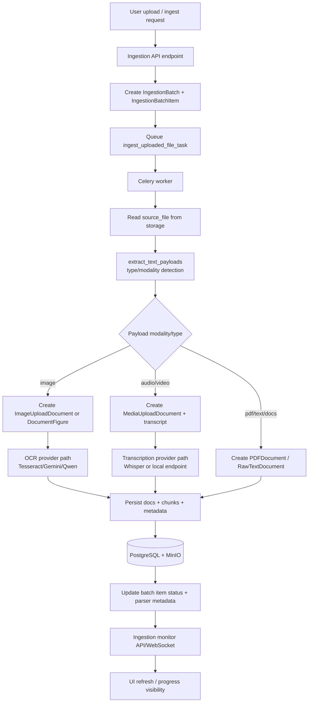
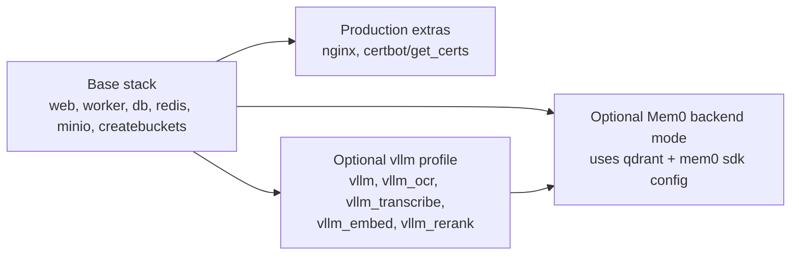

# AquiLLM Architecture (Mermaid)

This document captures the current architecture as implemented in the repository and compose configuration.

## 1) System Container View

```mermaid
flowchart LR
  %% Actors / clients
  U[Browser User]
  FE[React UI<br/>Vite + Tailwind build output]
  ZOT[Zotero API / OAuth]

  %% Edge / ingress
  NGINX[nginx + certbot<br/>Production]
  DEV[Direct web access :8080<br/>Development]

  %% App runtime
  WEB[web container<br/>Django ASGI + Channels]
  WORKER[worker container<br/>Celery async tasks]
  MODS[Domain modules<br/>chat, collections, documents,<br/>ingestion, memory, core,<br/>platform_admin, integrations.zotero]
  ORCH[Runtime orchestration<br/>WebSocket consumers + ingestion/parsers<br/>LLM routing + memory injection]

  %% Data / infra
  PG[(PostgreSQL + pgvector)]
  REDIS[(Redis<br/>Channels + Celery broker/result)]
  MINIO[(MinIO object storage)]
  QDRANT[(Qdrant<br/>optional for Mem0)]

  %% AI integrations
  HOSTED[Hosted model APIs<br/>OpenAI / Claude / Gemini]
  VLLM[Local vLLM profile (optional)<br/>chat + ocr + transcribe + embed + rerank]
  OCR[OCR / transcription providers<br/>Tesseract / Gemini / Qwen / Whisper]
  MEM0[Mem0 SDK backend (optional)]

  %% Core request paths
  FE --> U
  U --> NGINX
  U -. dev .-> DEV
  NGINX --> WEB
  DEV -.-> WEB

  WEB --> MODS
  WEB --> ORCH
  WEB --> WORKER
  WORKER --> ORCH

  %% App to data
  WEB --> PG
  WEB --> REDIS
  WEB --> MINIO
  WORKER --> PG
  WORKER --> REDIS
  WORKER --> MINIO
  ORCH -. optional .-> QDRANT

  %% App to AI
  ORCH --> HOSTED
  ORCH -. optional .-> VLLM
  ORCH --> OCR
  ORCH -. optional .-> MEM0
  MEM0 -.-> QDRANT
  MEM0 -.-> VLLM

  %% External integration
  MODS --> ZOT

  classDef optional stroke-dasharray: 5 4;
  class DEV,QDRANT,VLLM,MEM0 optional;
```

## 2) Chat Request Runtime Flow

```mermaid
flowchart TD
  USER[User message in UI] --> WSHTTP[HTTP/WebSocket to Django web]
  WSHTTP --> CHATAPI[Chat views / consumers]
  CHATAPI --> BUILDCTX[Build conversation context]
  BUILDCTX --> MEMSEL{Memory backend}
  MEMSEL -->|local| LOCALMEM[Local memory retrieval<br/>pgvector-backed]
  MEMSEL -->|mem0| MEM0R[Mem0 retrieval path]
  LOCALMEM --> PROMPT[Assemble system + retrieved memory]
  MEM0R --> PROMPT

  PROMPT --> ROUTE{LLM provider route}
  ROUTE -->|hosted| HOSTED[OpenAI / Claude / Gemini]
  ROUTE -->|local| VLLM[Local vLLM endpoint(s)]

  HOSTED --> RESP[LLM response]
  VLLM --> RESP
  RESP --> TOOL{Tool call?}
  TOOL -->|yes| TOOLS[Execute tools + append tool results]
  TOOLS --> ROUTE
  TOOL -->|no| SAVE[Persist messages]

  SAVE --> ASYNC[enqueue create_conversation_memories_task]
  ASYNC --> CELERY[Celery worker]
  CELERY --> MEMWRITE{Memory write mode}
  MEMWRITE -->|local| LWRITE[Write local episodic memory]
  MEMWRITE -->|mem0| MWRITE[Write Mem0 (optional dual-write local)]
  LWRITE --> RETURN[Send final answer to client]
  MWRITE --> RETURN
```

## 3) Unified Ingestion Runtime Flow



## 4) Deployment Profiles (compose-level)



## Notes

- Dashed nodes/edges represent optional or mode-dependent paths.
- React is built during web container startup and served as static assets through Django.
- WebSockets are handled by Channels (Redis channel layer).
- Celery worker handles asynchronous ingestion and memory-writing tasks.
