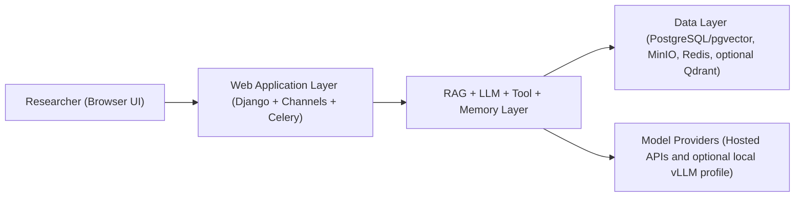
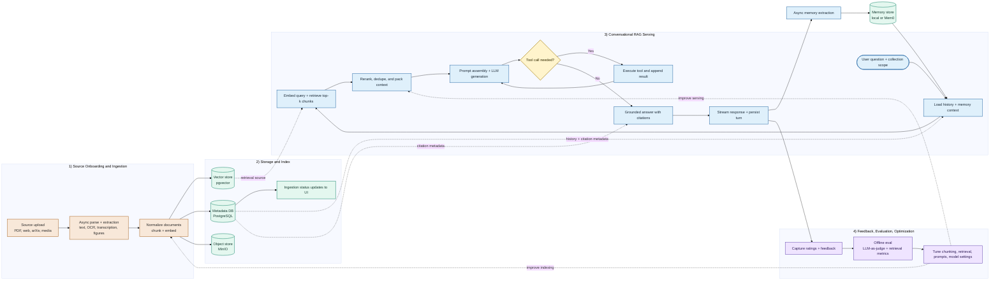
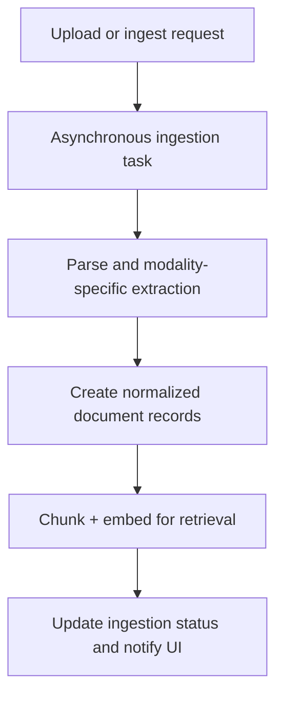

# AquiLLM Architecture (Paper-Friendly Simplified Version)

Last updated: 2026-03-25

This document is a simplified, publication-oriented summary of the AquiLLM system architecture. It is designed to support manuscript writing, figures, and method sections without implementation-level detail.

## 1) System Overview

AquiLLM is a retrieval-augmented research assistant platform with four primary layers:

1. User layer: browser-based interface for chat, collection management, and ingestion.
2. Application layer: Django + Channels backend for APIs, page rendering, and real-time chat/ingestion updates.
3. Intelligence layer: LLM orchestration, retrieval, tools, memory, and multimodal parsing.
4. Data layer: PostgreSQL/pgvector, object storage, Redis, and optional Qdrant/Mem0 integration.

## 2) Core Functional Subsystems

### 2.1 Conversational RAG

- Users chat over WebSockets with persistent conversation history.
- The system injects:
  - current conversation context,
  - retrieved document chunks,
  - optional user memory context.
- The assistant can call tools (document search, document expansion, and domain-specific utilities) before final response generation.

### 2.2 Unified Multiformat Ingestion

- A single ingestion pathway supports heterogeneous input types:
  - document files,
  - images (OCR),
  - audio/video (transcription),
  - web pages,
  - arXiv imports,
  - archive expansion.
- Ingestion is asynchronous, with batch tracking and status reporting to the UI.
- Parsed content is normalized into document models and chunked for retrieval.

### 2.3 Memory Augmentation

- Two memory classes are used:
  - stable user facts/preferences,
  - episodic semantic memories from prior interactions.
- Memory can run in:
  - local mode (pgvector tables),
  - Mem0 mode (optional), with optional dual-write to local storage.

### 2.4 Research Workflow and Organization

- Documents are grouped into hierarchical collections with per-user permissions.
- Chat retrieval scope is collection-aware.
- Platform admin and feedback export support operational evaluation and governance workflows.

## 3) High-Level Runtime Flows

### 3.1 End-to-End System Flow (Moderate Detail)

### 3.2 Ingestion Flow (Simplified)

## 4) Technology Stack (Concise)

- Backend: Python, Django, Channels, Celery
- Frontend: React mounted into Django templates
- Datastores:
  - PostgreSQL + pgvector for structured and vector data
  - MinIO for document/file objects
  - Redis for pub/sub and task brokering
  - optional Qdrant for Mem0-backed memory
- Model access:
  - hosted model APIs (e.g., OpenAI/Anthropic/Gemini)
  - optional local vLLM profile for chat, OCR, transcription, embeddings, and reranking

## 5) Architectural Contributions (Paper-Oriented Framing)

Potential contribution framing for a manuscript:

1. Unified multimodal ingestion-to-retrieval pipeline for research corpora.
2. Collection-scoped conversational RAG with integrated tool use.
3. Hybrid memory augmentation (stable facts + episodic retrieval) with pluggable backends.
4. Practical deployment flexibility across hosted-model and local-model operation modes.

## 6) Current Constraints (For Discussion/Limitations Section)

1. Transitional architecture: compatibility shims still coexist with domain-app modules.
2. Provider asymmetry: streaming behavior differs across LLM providers.
3. Hybrid UI model: page-routing plus React islands rather than a single SPA router.
4. Eventual consistency in memory writes: new episodic memories are asynchronous.
5. Some retrieval/model operations remain sensitive to corpus size and infrastructure sizing.

## 7) Suggested Use in a Paper

You can use this document to seed:

1. A one-figure system architecture section (use Diagram 1).
2. A methods subsection for chat/runtime behavior (use Chat Flow).
3. A methods subsection for ingestion/data processing (use Ingestion Flow).
4. A limitations paragraph (adapt Section 6).
