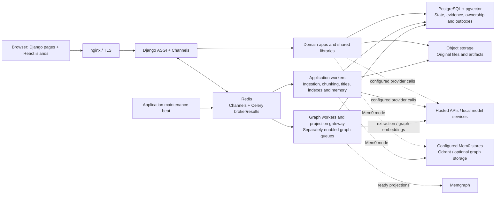
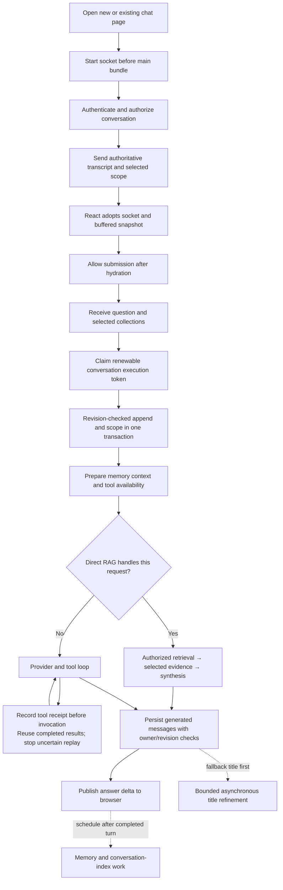
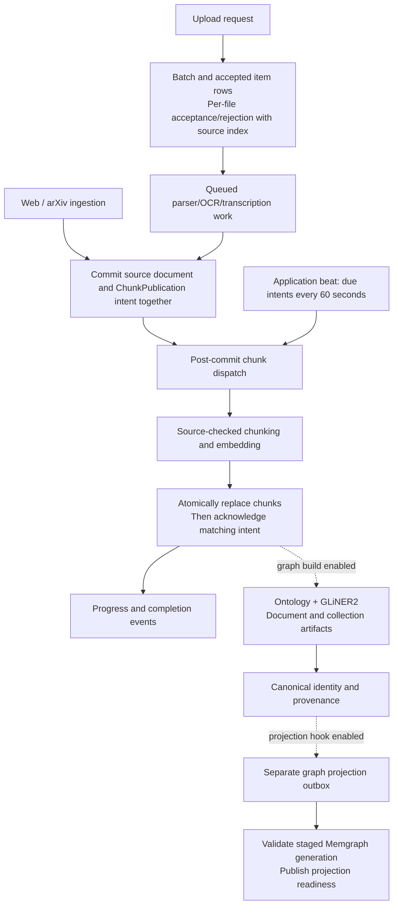

# AquiLLM current architecture

Last updated: 2026-09-29. Source baseline: development revision [9518c6d51b74d163d594de29ec3a8764a63f56c3](https://github.com/AquiLLM/AquiLLM/tree/9518c6d51b74d163d594de29ec3a8764a63f56c3).

AquiLLM combines Django-rendered pages and React components with an ASGI chat service, permission-scoped document retrieval, background graph construction, and conversation memory. PostgreSQL owns application state; Redis carries WebSocket events and task delivery. Optional model and graph services contribute capabilities without defining whether the core web process is ready.

The [retrieval-path guide](2026-09-28-knowledge-graph-and-retrieval-pipeline.md) explains query preparation, dense/trigram/exact search, direct and extended graph seeds, Personalized PageRank, reranking, evidence selection and citations. Its [rendered diagram](2026-09-28-knowledge-graph-and-retrieval-pipeline.svg) and [Mermaid source](2026-09-28-knowledge-graph-and-retrieval-pipeline.mmd) accompany this runtime overview. The [retrieval audit](2026-09-29-retrieval-system-audit.md) preserves historical quality findings and proposed experiments; those proposals are not implemented features.

## Runtime boundaries

- `apps.chat` owns chat transport, transcript persistence, execution ownership, retrieval orchestration and conversation indexing.
- `apps.ingestion` owns upload batches, web/arXiv ingestion and progress reporting. `apps.documents` owns source documents, chunks, search/reranking and recoverable chunk publication.
- `apps.collections` owns hierarchy, access control and collection schema workflows. `apps.knowledge_graph` owns versioned graph artifacts, canonical identity, projection readiness and graph retrieval.
- `apps.memory` owns local memory models and durable conversation-memory jobs. `apps.core`, `apps.platform_admin`, and integrations provide common pages, health/capabilities, administration and external integrations.
- `lib.llm`, `lib.tools`, `lib.parsers`, `lib.ocr`, `lib.embeddings`, and `lib.memory` contain reusable provider and processing logic. Compatibility exports in `aquillm.models`, views and API modules remain active; older `chat` and `ingest` registrations still coexist with domain apps.

Source entry points: [ASGI](../../../aquillm/aquillm/asgi.py), [routes](../../../aquillm/aquillm/urls.py), [Celery](../../../aquillm/aquillm/celery.py), [settings](../../../aquillm/aquillm/settings.py), [development Compose](../../../deploy/compose/development.yml).

## Chat startup and turn execution

The initial snapshot does not wait for memory retrieval or model work. An additional viewer can hydrate while another owns the turn; pending-turn recovery waits cancellably, then reloads the latest transcript and saved scope before deciding whether work remains. Drafting works during startup, while Send and Enter are gated until hydration. Routine startup status is delayed; persistent failures, permanent close codes and explicit retry remain visible. The browser uses a bounded reconnect policy and one adopted chat socket.

Every generation path uses a cancellable ASGI task independently of the evidence-preservation switches. A PostgreSQL execution token has a 60-second lease renewed every 20 seconds. Durable per-call receipts and transcript publication checks prevent automatic duplicate execution in the covered reconnect cases. A synchronous tool may outlive cancellation; an uncertain call is surfaced for user-directed recovery. These mechanisms do not guarantee exactly-once effects in an external system after a process or database failure.

Scope changes submitted with a message commit with that transcript revision. Standalone selection updates remain a separate action. Permissions are rechecked by document tools and source materialization. Chat collection-list loading and retry state are separate from WebSocket state, preserving saved scope when the collection request fails.

Provider selection comes from `LLM_CHOICE`; direct RAG, explicit manual search and the ordinary tool loop have distinct routing rules. Current tool wiring can include document, past-chat/memory, astronomy and enabled skill/debug tools. Provider adapters and request budgets govern generation and tool limits.

Sources: [early socket bootstrap](../../../aquillm/templates/aquillm/includes/chat_socket_bootstrap.js), [React socket lifecycle](../../../react/src/features/chat/hooks/useChatWebSocket.ts), [consumer](../../../aquillm/apps/chat/consumers/chat.py), [append handling](../../../aquillm/apps/chat/consumers/chat_receive.py), [execution ownership](../../../aquillm/apps/chat/services/execution.py), [tool receipts](../../../aquillm/lib/llm/providers/tool_execution.py), [persistence](../../../aquillm/aquillm/message_adapters.py).

## Ingestion and graph preparation

Chunk publication records exact source identity and survives a failed broker publish. Recovery normally processes up to 25 due intents per minute, with capped backoff and a publication lease. Chunk commit checks source/lifecycle identity and acknowledges the matching intent. Redelivery is possible; the publication lease is not exclusive ownership of long-running embedding work. The graph projection outbox is a separate lifecycle, and an active graph artifact is not necessarily a ready query projection.

Upload state retains both initial rejections and later processing failures. Queued rows are excluded from resubmission, same-name files are mapped using their source indices, and polling retries do not submit another batch. Collection refresh preserves the upload workspace and fences superseded responses. The ingestion dashboard uses a stable socket callback, deduplicates document replay, and respects dismissal for already-seen work.

Sources: [batch acceptance](../../../aquillm/apps/ingestion/services/upload_batches.py), [document lifecycle](../../../aquillm/apps/documents/models/document.py), [publication recovery](../../../aquillm/apps/documents/services/chunk_publication.py), [chunk task](../../../aquillm/apps/documents/tasks/chunking.py), [graph projection](../../../aquillm/apps/knowledge_graph/projection/worker.py), [upload polling](../../../react/src/features/ingestion/hooks/useIngestUploadBatchPolling.ts).

## Conversation memory and past-chat search

Document retrieval, conversation indexing and memory are distinct paths. Document/graph search supplies authorized collection evidence. `ConversationChunk` stores searchable past-chat passages. `UserMemoryFact` and `EpisodicMemory`, or the configured Mem0 stores, support user-context memory.

Before a pending or newly appended turn runs, memory augmentation rebuilds the model context from the base system prompt and profile facts. Episodic lookup can be skipped for collection-scoped turns. Hydrating an idle chat does not perform this generation-time lookup.

After the answer is published, indexing and memory enqueue run outside the shared thread-sensitive database lane with bounded waits. Title generation is also separate: persistence assigns a deterministic fallback, and a bounded Celery refinement changes it only while that fallback still matches, without changing conversation activity time.

| Background path | Completion and recovery contract |
|---|---|
| Conversation index | Debounced transcript hash rather than general metadata time. Missing embeddings leave the index incomplete and keyword chunks available. Up to five retries use 60–900 second backoff; normal enqueue or `index_conversations` can repair an exhausted or legacy incomplete index. |
| Conversation memory | One durable row per conversation coalesces desired transcript hashes. User-idle checks defer work without creating a retry chain. Periodic recovery retries due work; a PostgreSQL session advisory lock prevents concurrent live inference even after its row lease expires. |
| Mem0 write completion | Strict worker calls wait for the provider call to finish and propagate failure. A successful response with no additions completes normally. Profile promotion and optional local dual-write follow success, so local dedupe cannot hide a newly failed remote write. |

The memory owner holds a separate database session, not an open transaction, during provider inference. Worker death releases the session lock and leaves durable work recoverable after the lease. Remote acceptance followed by process failure can still be ambiguous; retries are not an exactly-once guarantee. Memory remains eventually consistent. Local episodic rows retain per-assistant-message deduplication; existing rows are not globally replayed by this release.

Sources: [chat persistence and enqueue](../../../aquillm/apps/chat/consumers/chat_persistence.py), [title task](../../../aquillm/apps/chat/tasks/title.py), [conversation index](../../../aquillm/apps/chat/tasks/conversation_indexing.py), [memory jobs](../../../aquillm/apps/memory/jobs.py), [memory creation](../../../aquillm/aquillm/memory.py), [Mem0 operations](../../../aquillm/lib/memory/mem0/operations.py).

## Build, deployment and readiness

The production image builds Vite/Tailwind assets and stores them in `/opt/aquillm-static`, ahead of source-tree assets in Django's static lookup. It caches `o200k_base` and `cl100k_base` tokenizers under `/opt/aquillm-tokenizers`. Both survive the `/app` source bind mount. Startup applies migrations, collects static files and starts ASGI; frontend installation/build and tokenizer downloads are no longer startup requirements. Supplemental Python packages are constrained to the reviewed runtime versions after the frozen `uv` installation.

Nginx uses five-second backend DNS caching. The deployment reload script re-renders templates, validates the configuration and reloads routing after backend replacement. The provided systemd health supervisor uses the configured Host header and finite probe timeouts; a failed probe logs the outage instead of stopping the entire Compose stack.

| Endpoint or service | What it establishes |
|---|---|
| `/health/` | The HTTP process is alive. |
| `/ready/` | Bounded PostgreSQL and Redis probes pass; optional provider availability and worker backlog are not checked. |
| Authenticated `/api/capabilities/` | Optional transcription availability through a bounded model-list probe. |
| `scheduler_application_maintenance` | Publishes capped document and memory recovery tasks on the application queue every minute. Its graph schedule is disabled. |
| Graph maintenance scheduler | Separate graph recovery/projection lifecycle; application maintenance is disabled there. |

The September 29 development rollout used explicit application services with `--no-deps`, applied the chat/document/memory migrations, and verified public HTTP/readiness, WebSocket hydration, new/existing-chat startup, asset identity and recovery-task execution. The live `.env`, unrelated service identities and model resource settings were preserved. Transcription is intentionally stopped for development capacity constraints. Generic full-stack startup scripts still describe optional model services; they are not an instruction to re-enable transcription for an application-only rollout.

The checked-in development retrieval profile is described separately in the [retrieval guide](2026-09-28-knowledge-graph-and-retrieval-pipeline.md#configuration-and-the-development-profile). Source defaults, recorded rollout flags and benchmark results must not be treated as interchangeable.

Sources: [Dockerfile](../../../deploy/docker/web/Dockerfile.prod), [runtime constraints](../../../deploy/docker/web/runtime-constraints.txt), [startup](../../../deploy/scripts/run.sh), [static configuration](../../../aquillm/aquillm/settings.py), [health probes](../../../aquillm/apps/core/views/health.py), [application schedules](../../../aquillm/aquillm/celery_schedules.py), [proxy reload](../../../deploy/scripts/reload_proxy.sh), [stability audit](../../audits/2026-09-29-application-stability.md).

## Limits and interpretation

- Retrieval features remain gated. Direct RAG, graph traversal, adaptive selection and source-preservation modes have their own controls and validated dependencies.
- Graph PageRank discovers candidate evidence; reranking, query-list fusion and final selection decide what is delivered. A syntactically valid citation does not prove entailment or complete answer support.
- The stability release does not establish retrieval-quality improvements, embedding-model compatibility across an existing corpus, or current end-to-end model latency. The [historical retrieval audit](2026-09-29-retrieval-system-audit.md) separates verified code paths from experiments still requiring evidence.
- External effects can survive cancellation or a lost connection. Durable ownership, receipts and outboxes limit replay and preserve recovery state; their documented failure boundaries still apply.
- UI navigation remains page-based with React islands, provider streaming differs by adapter, and ingestion costs depend on parser/model availability. Optional capabilities can be unavailable while core readiness remains healthy.
