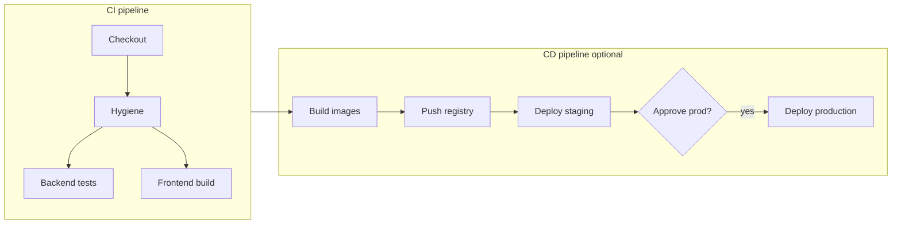

# Jenkins pipeline design — AquiLLM CI and deployment

**Status:** Draft specification  
**Date:** 2026-03-25  
**Scope:** Jenkins-based continuous integration (tests, hygiene checks) and continuous delivery (server deploys) for the AquiLLM repository.

## 1. Purpose

This document specifies how to implement Jenkins pipelines that:

- Run the same *logical* checks as the existing GitHub Actions workflows, so results are comparable across CI systems.
- Support optional **deployment** to controlled environments (for example staging and production) with clear gates, secrets handling, and rollback hooks.

It does **not** mandate replacing GitHub Actions. Teams may run Jenkins alongside GitHub Actions, or migrate gradually.

## 2. Context in this repository

### 2.1 Existing automation (reference parity)

The repository already defines CI in `.github/workflows/`:

| Workflow | What it runs |
|----------|----------------|
| `test-backend-frontend.yml` | Backend: Python 3.12, `pip install -r requirements.txt`, `manage.py check`, targeted `pytest` integration tests with **PostgreSQL 16 + pgvector** service. Frontend: Node 20, `npm ci` / `npm run build` under `react/`. |
| `hygiene-check.yml` | `scripts/check_hygiene.ps1` (PowerShell), `scripts/check_file_lengths.py`, `scripts/check_import_boundaries.py`. |

**Jenkins parity goal:** Any Jenkins pipeline labeled “CI” should be able to reproduce these jobs (same commands, equivalent services). Branch triggers should mirror policy (for example `main`, `master`, `development`, and pull requests) unless org policy differs.

### 2.2 Runtime and deploy artifacts

- **Backend:** Django 5.1, Python 3.12, Celery, Channels; database expectations match `pgvector/pgvector:pg16` patterns used in CI.
- **Frontend:** React build in `react/` with `package-lock.json`.
- **Containers:** Docker Compose stacks under `deploy/compose/` (`base.yml`, `development.yml`, `production.yml`, `test.yml`); images and scripts under `deploy/docker/` and `deploy/scripts/`.

Deploy implementations may use **Docker Compose on a VM**, **Kubernetes**, or **vendor-specific** runtimes; this spec describes pipeline *stages* and *contracts*, not a single cloud provider.

## 3. Goals and non-goals

### Goals

1. **Fast feedback** on every change: lint/hygiene, backend smoke, frontend build.
2. **Reproducible** builds: pinned toolchains (Python 3.12, Node 20), cached dependencies where safe.
3. **Safe deploys:** explicit approvals for production, immutable artifacts (image tags / git SHA), audit trail.
4. **Secret hygiene:** no secrets in job logs; credentials injected from Jenkins credential store or external secret managers (for example Vault, cloud secret managers — see org standards).

### Non-goals

- Prescribing a specific Jenkins distribution (CloudBees, OSS, Kubernetes operators) beyond generic requirements.
- Replacing application-level configuration documented in `.env.example` — only *how* those values reach deploy environments is in scope.

## 4. High-level architecture



- **CI** may run on every PR and on pushes to protected branches.
- **CD** is typically a separate multibranch or parameterized pipeline, or downstream job triggered only from selected branches/tags.

## 5. Pipeline styles and repository layout

### 5.1 Recommended: Declarative Pipeline in `Jenkinsfile`

- **Single `Jenkinsfile`** at repo root (or `deploy/jenkins/Jenkinsfile` with Jenkins job configured to load it) using **Declarative Pipeline** syntax for readability and built-in `options`, `post`, and `when` blocks.
- Use **parallel stages** for independent work (hygiene scripts vs frontend vs backend) where agent resources allow.

### 5.2 Alternative: Scripted Pipeline or Shared Library

- Use a **Shared Library** if many repositories need identical steps; keep AquiLLM-specific commands (paths, pytest lists) in a thin wrapper pipeline.

### 5.3 Multibranch vs freestyle

- **Multibranch Pipeline** is recommended: automatic PR and branch builds with the same `Jenkinsfile`, environment discovery via `BRANCH_NAME` / `CHANGE_ID`.

## 6. Agents and tooling

### 6.1 Agent labels

Define consistent labels, for example:

| Label | Use |
|-------|-----|
| `linux-docker` | Docker CLI available; for building images and running compose-based integration tests. |
| `linux` | General Python/Node without Docker. |

Backend tests that need PostgreSQL can use:

- **Docker sidecar** on the agent (`docker run` pgvector image with published port), matching GitHub Actions service semantics, or  
- **Permanent Postgres** on a dedicated test agent (less isolated; document reset procedure).

### 6.2 Hygiene job and PowerShell

`check_hygiene.ps1` is invoked with PowerShell in GitHub Actions. On Jenkins:

- Run on a **Windows agent** with PowerShell, or  
- Use **PowerShell Core (`pwsh`) on Linux** if available on the agent (same approach as hygiene workflow).

If neither is available, add a **bash-equivalent** hygiene path in a follow-up (out of scope for this spec) or gate the PowerShell step behind a label.

### 6.3 Caching

- **pip:** cache `~/.cache/pip` or use a Jenkins plugin that caches based on `requirements.txt` hash.  
- **npm:** cache `~/.npm` or `react/node_modules` keyed on `react/package-lock.json`.

## 7. CI stages (detailed)

### Stage: Checkout

- Shallow clone is acceptable for speed; use full clone if the pipeline needs tags or merge-base behavior.

### Stage: Hygiene (parallel-friendly)

1. `pwsh -ExecutionPolicy Bypass -File scripts/check_hygiene.ps1` (or Windows agent equivalent).  
2. `python scripts/check_file_lengths.py`  
3. `python scripts/check_import_boundaries.py`

Python version: **3.12** to match CI.

### Stage: Backend smoke

1. Create virtualenv or use preinstalled Python 3.12.  
2. `pip install -r requirements.txt`  
3. Start PostgreSQL with pgvector (container or service) and set env vars to mirror `.github/workflows/test-backend-frontend.yml` (`POSTGRES_*`, `DJANGO_DEBUG`, `SECRET_KEY`, dummy LLM keys for tests that do not call live APIs).  
4. `cd aquillm && python manage.py check`  
5. Run the same pytest subset as in CI:

   ```text
   python -m pytest aquillm/tests/integration/test_architecture_import_boundaries.py \
     aquillm/tests/integration/test_context_processors_urls.py \
     aquillm/tests/integration/test_document_image_view.py -q --tb=short
   ```

**Optional nightly or release-only job:** broader suites (for example `apps/chat/tests`, `lib/llm/tests`) as documented in internal plans — not required for parity with current GitHub Actions.

### Stage: Frontend build

1. `cd react`  
2. `npm ci`  
3. `npm run build`

Node: **20.x**, with `package-lock.json` as the lockfile.

### Post actions

- Publish **JUnit** or pytest reports if the `junit` step or plugin is configured.  
- Archive **build outputs** only when needed (for example `react/dist` for downstream deploy); default is no long-term storage of `node_modules`.

## 8. CD stages (deployment)

### 8.1 Principles

1. **One artifact per deploy:** container images tagged with **git commit SHA** (and optionally branch name); never rely on `:latest` alone for production.  
2. **Configuration:** inject secrets at deploy time (Compose env files from secrets, Kubernetes Secrets, or cloud parameter stores).  
3. **Environments:** at minimum **staging** (automatic or on merge to a release branch) and **production** (manual approval).

### 8.2 Build and push images

- Use `deploy/docker/**/Dockerfile` targets appropriate for production (`Dockerfile.prod` where applicable).  
- Push to a registry (GHCR, ECR, GCR, private Harbor, etc.) with IAM or token credentials stored in Jenkins.

### 8.3 Deploy staging

- **Compose:** SSH or agent on target host runs `docker compose -f deploy/compose/production.yml` (or overlay) with env from secure storage; run migrations and health checks (`deploy/scripts/healthcheck.sh` or HTTP probe).  
- **Kubernetes:** `kubectl apply` / Helm upgrade with values from CI or from GitOps repo; respect org GitOps policy if Argo CD / Flux owns cluster state.

### 8.4 Deploy production

- **Input step** or **Promoted Builds** plugin: require named approvers.  
- Optionally **blue/green** or **rolling** strategy depending on platform; document rollback: redeploy previous image tag or `helm rollback`.

### 8.5 Smoke after deploy

- HTTP health endpoint check, minimal authenticated check if credentials available in a **test-only** Jenkins credential.

## 9. Credentials and security

| Secret type | Jenkins approach |
|-------------|------------------|
| Registry push | Username/password or token (Docker config JSON). |
| SSH deploy key | `sshAgent` with private key credential. |
| API tokens | Secret text; mask in console log. |
| Cloud IAM | OIDC federation from Jenkins to cloud (preferred over long-lived keys where supported). |

- Enable **masking** for all secret-like env vars.  
- Restrict **multibranch PR builds** from untrusted forks: do not expose deploy credentials to PR pipelines (GitHub Actions analogy: secrets unavailable to fork PRs). Use a separate job that only runs on trusted branches.

## 10. Branch and trigger policy (suggested defaults)

| Event | CI | CD staging | CD production |
|-------|----|------------|---------------|
| PR | Yes | No | No |
| Push to `development` | Yes | Optional | No |
| Push to `main` / `master` | Yes | Yes (optional) | No (manual only) |
| Git tag `v*` | Yes | Yes | Optional manual promote |

Adjust to match team branching model.

## 11. Observability and operations

- **Notifications:** Slack, email, or Microsoft Teams on fixed/unstable/recovered via `post { failure { ... } }`.  
- **Build retention:** align with disk policy; artifact retention shorter for PR builds than for main.  
- **Correlation:** expose `GIT_COMMIT` in all deploy logs and monitoring tags.

## 12. Implementation options (trade-offs)

| Approach | Pros | Cons |
|----------|------|------|
| **A. Single `Jenkinsfile` with `when` for CD** | One file, easy to browse | Long file; CD credentials must be carefully scoped by branch |
| **B. Separate Jenkins jobs: `aquillm-ci` vs `aquillm-deploy`** | Clear separation; deploy job can have stricter ACLs | Duplication unless Shared Library used |
| **C. Jenkins X / Tekton elsewhere, Jenkins only for legacy** | Modern K8s-native | Extra moving parts |

**Recommendation:** Start with **B** (separate CI multibranch job and a parameterized or tag-triggered deploy job) until patterns stabilize; extract a Shared Library if more services adopt the same flow.

## 13. Example skeleton (Declarative, illustrative)

Not a drop-in replacement for testing; illustrates stage ordering and parallel hygiene:

```groovy
pipeline {
  agent { label 'linux' }
  options {
    timestamps()
    timeout(time: 45, unit: 'MINUTES')
  }
  environment {
    DJANGO_DEBUG = '1'
    SECRET_KEY = 'ci-not-secret'
    POSTGRES_HOST = 'localhost'
    POSTGRES_NAME = 'aquillm'
    POSTGRES_USER = 'aquillm'
    POSTGRES_PASSWORD = 'aquillm'
    OPENAI_API_KEY = 'ci-dummy'
    GEMINI_API_KEY = 'ci-dummy'
  }
  stages {
    stage('Checkout') {
      steps { checkout scm }
    }
    stage('CI') {
      parallel {
        stage('Hygiene') {
          steps {
            sh 'python3.12 -m pip install -r requirements.txt || pip install -r requirements.txt'
            sh 'python scripts/check_file_lengths.py'
            sh 'python scripts/check_import_boundaries.py'
          }
        }
        stage('Frontend') {
          steps {
            dir('react') {
              sh 'npm ci && npm run build'
            }
          }
        }
        stage('Backend') {
          steps {
            // Start Postgres/pgvector (e.g. docker run) before these steps in your environment
            sh 'pip install -r requirements.txt'
            dir('aquillm') { sh 'python manage.py check' }
            sh '''python -m pytest \\
              aquillm/tests/integration/test_architecture_import_boundaries.py \\
              aquillm/tests/integration/test_context_processors_urls.py \\
              aquillm/tests/integration/test_document_image_view.py -q --tb=short'''
          }
        }
      }
    }
  }
  post {
    always { cleanWs() }
  }
}
```

Add `pwsh` hygiene, Docker-based Postgres, and proper caching in the real `Jenkinsfile`.

## 14. Verification

Before calling the Jenkins migration complete:

1. Run Jenkins CI on the same commit as GitHub Actions and compare stage outcomes (pass/fail).  
2. Perform a **dry-run deploy** to staging with a non-production database.  
3. Confirm **secrets** never appear in console output (use test credentials).

## 15. References

- `.github/workflows/test-backend-frontend.yml` — backend and frontend commands and Postgres service.  
- `.github/workflows/hygiene-check.yml` — hygiene scripts.  
- `deploy/compose/` — Compose entrypoints for environments.  
- `README.md` — local and Docker quick start.

---

## Revision history

| Date | Author | Notes |
|------|--------|--------|
| 2026-03-25 | — | Initial draft |
