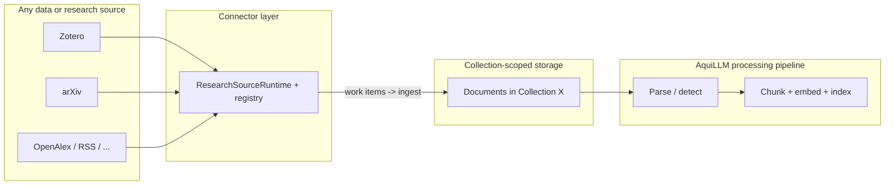

# Research source connectors - pluggable integration design

**Date:** 2026-03-25  
**Status:** Design (principal-engineering review)  
**Related:**

- [2026-03-16 - Unified, source-agnostic document ingestion](./2026-03-16-auto-ingest-design.md) - sources vs parsers, `UnifiedIngestService`, provenance
- [MCP + Skills + Agents runtime (architecture placeholder)](../documents/architecture/mcp-skills-agents-runtime.md) - to be expanded alongside implementation
- Roadmap (pending): [MCP, skills, and agents structure](../roadmap/plans/pending/2026-03-20-mcp-skills-agents-structure.md), [agentic support services (vendor-agnostic)](../roadmap/plans/pending/2026-03-20-agentic-support-services-vendor-agnostic.md)

## Problem

AquiLLM already separates **where bytes come from** (uploads, Zotero, arXiv, web) from **how bytes become text** (parser registry). In practice, each new research system still tends to accumulate bespoke HTTP views, Celery tasks, OAuth flows, and error strings in different packages. That raises the cost of adding sources (for example Semantic Scholar, OpenAlex, institutional repos, RSS) and makes behavior inconsistent across APIs.

We need a **single, boring extension model** so that:

- Adding a source is mostly "implement one adapter + register + config," not a cross-cutting refactor.
- Operators get **predictable** reliability: retries, rate limits, structured errors, and observability per source.
- The **document pipeline** stays one place: normalized inputs -> detect -> parse -> persist -> chunk (existing design).

## Goals

1. **Plugin-shaped sources** - Each external research system implements a small, documented interface. Registration is explicit (code or config), not scattered `if provider == "arxiv"`.
2. **Stable contracts** - Inbound: credentials and user intent (collection, filters). Outbound: streams or batches of normalized work items that map to existing `IngestionInput` / `source_ref` shapes from the unified ingestion design.
3. **Operational clarity** - Per-source quotas, backoff, idempotency keys, and metrics (success/skip/error counts) without custom dashboards per integration.
4. **Progressive complexity** - A minimal source (for example "fetch PDF by public URL + fixed metadata") is a thin adapter; OAuth-heavy sources (Zotero) plug the same outer interface with a richer connection model.
5. **Collection-scoped pipeline** - Connector output always lands in a user-chosen collection and immediately feeds the same AquiLLM document processing stack (parse -> persist -> chunk -> embed -> retrieval) as uploads; sources differ only upstream of that stack.
6. **Independently scalable connector services** - Connector execution is not tied to the web request lifecycle: it runs in separate worker pools or services so data ingestion can scale out (per-connector queues, replicas, resource limits) without scaling the entire Django app or the embedding pipeline in lockstep.
7. **Evolution-safe contracts** - Connector capability schemas, request/response envelopes, and work-item payloads are versioned and compatibility-tested so connectors can evolve without breaking tools, APIs, or workers.

## End-to-end: any source, one downstream pipeline

Connectors answer: *how do we obtain and normalize content from this external system?* They do **not** define a second indexing or embedding path.

**Pluggability.** In principle any data or research source can sit on this architecture if it can be wrapped to:

- emit work items (`IngestionInput` + `source_ref` + metadata), and
- respect the runtime contract (auth context, rate limits, structured results).

Bibliographic APIs, institutional repos, RSS, OAI-PMH, generic HTTP file buckets, or a user's MCP-backed library are all connector implementations, not separate product verticals. Each new source is register + adapter module, not a fork of chunking or embeddings.

**Collections as the handoff.** Every ingest operation is scoped to a `Collection` (and an acting user with edit permission). Whether the user "builds a collection from Zotero," "imports arXiv papers into this project," or syncs a library, the runtime receives `collection_id` (or equivalent) and creates documents in that collection. That is what "make a collection out of it" means in product terms: the collection is the container; the connector fills it with documents.

**Single processing pipeline.** After a document row exists for that collection, processing is identical for every source:

1. Unified ingest / parser registry (bytes -> `full_text`, assets, metadata) - see [unified ingestion](./2026-03-16-auto-ingest-design.md).
2. Existing AquiLLM data processing pipeline: chunking, embedding, index updates, and anything else tied to `create_chunks` / document lifecycle today.

No per-source chunk strategies or embedding routes in v1 of this design unless product explicitly requires them; connectors stop at "document materialized in collection."

## Non-goals

- Replacing the parser registry or chunking pipeline (reuse [unified ingestion](./2026-03-16-auto-ingest-design.md)).
- Mandating one HTTP endpoint per source forever (see API surface; we may keep thin HTTP shims that delegate to the registry).
- Building a full ETL platform; scope stays "get research artifacts into collections reliably."
- Using MCP or the agent runtime as the primary transport for OAuth-backed sync (for example Zotero): user flows and tokens remain server-side in Django; agents and MCP call the same connector runtime via controlled tools.

## Concepts

### 1. Research source vs parser

| Layer | Responsibility | Examples |
|--------|----------------|----------|
| **Research source connector** | Auth, listing/search, download URLs, rate limits, normalization to canonical identifiers (DOI, arXiv ID, ISBN), mapping to `IngestionInput` | Zotero API, [arXiv API](https://arxiv.org/), OpenAlex |
| **Parser** | Bytes -> `full_text` + metadata | PDF, HTML, OCR |

Connectors produce candidate documents (bytes or text + `source_ref` + optional Dublin-Core-ish metadata). Parsers do not know about Zotero or arXiv.

### 2. Canonical identifiers (cross-source dedupe)

Internally, prefer a small normalized key space for dedupe and UI:

- `arxiv_id` (normalized: versionless where appropriate; policy documented per connector)
- `doi` (lowercased, URL form optional)
- `source_provider` + `source_id` (opaque stable id from the provider, for example Zotero attachment key)

Connectors may emit multiple identifiers; persistence follows existing `(source_provider, source_id)` rules with optional future "same work" merge by DOI (out of scope for v1 unless product asks).

### 2.1 Contract versioning and compatibility

To keep connectors extensible across transports (HTTP, tasks, MCP tools), all runtime contracts should be explicitly versioned:

- `connector_api_version` on each connector manifest.
- `request_schema_version` and `result_schema_version` on runtime-facing APIs.
- `work_item_schema_version` on emitted work items.

Compatibility policy:

- Runtime supports current and previous schema minor versions (N and N-1).
- Breaking changes require a new major version and a dual-read migration period.
- Connector registration fails fast at startup if declared versions are unsupported.

### 3. Connector interface (logical)

A connector is not necessarily one class; it is a capability bundle the runtime can query:

- **`manifest()`** - Returns connector metadata (`connector_id`, versions, capability descriptors, default limits, auth mode).
- **`capabilities`** - Typed capability descriptors (not only string flags), for example `manual_import_by_id`, `sync_library`, `search`, `resolve_url`, each with input/output schema and policy hints (max batch size, cost class, human confirmation required).
- **`ingest_items(request) -> IngestResult`** - Given a typed request (import one arXiv id, sync Zotero folder, and so on) including target collection + user context, yield work items that the core turns into `IngestionInput` and hands to the unified ingest path.
- **`health_check()`** - Optional; for ops (API reachable, token valid).

**Work item** (conceptual):

- `ingestion_input`: one of `RemoteBytesInput` / `RemoteTextInput` / ... (see unified design).
- `source_ref`: provider-specific dict (already specified in unified design).
- `display_title`, `external_urls`, `authors`, `published_at` - optional metadata for document rows and UI.
- `dedupe_key` - idempotency key compatible with DB unique constraints.
- `schema_version`, `job_id`, `attempt_id`, `trace_id` - envelope metadata for replay/debuggability.

### 4. Registry

- **Code registry** - `CONNECTORS = {"zotero": ZoteroConnector, "arxiv": ArxivConnector, ...}` (import side effects acceptable at startup). This is the logical catalog; implementations may run out-of-process.
- **Config** - Per-environment enable flags, default timeouts, max concurrent jobs per source (env or DB `IntegrationSettings`).
- **Registration checks** - Validate connector manifest (versions, schemas, declared capabilities, required secrets) at startup and expose a machine-readable registry snapshot for ops and tooling.

New sources add one module under for example `apps/integrations/research_sources/<name>/` implementing the interface + tests, then one line in the registry (and URL include if needed).

### 5. Execution modes

| Mode | Use case | Notes |
|------|-----------|--------|
| **Synchronous pull** | User submits arXiv id / URL | Fast path; still enqueue heavy parse/chunk async if that is today's pattern |
| **Background sync** | Zotero library | Celery beat or user-triggered; checkpoint cursor per connection |
| **Webhook / push** | Future | Same work-item queue; connector translates payload -> work items |

### 6. Reliability and fairness

- **Rate limiting** - Per-connector token bucket (arXiv [usage guidelines](https://arxiv.org/), Zotero API limits, etc.).
- **Retries** - Classify errors: retryable (5xx, timeout) vs permanent (404, auth). Exponential backoff with jitter; cap attempts.
- **Circuit breakers** - Trip and cool down on sustained upstream failures to prevent retry storms.
- **Backpressure and admission control** - Gate connector intake using downstream parse/embed health (queue depth, p95 latency, error burn rate) so connector autoscaling cannot flood ingestion.
- **Retry budgets** - Per connector and per job type retry budgets to bound cost and preserve fairness.
- **Partial success** - Same per-item result contract as unified ingestion (`accepted`, `skipped_duplicate`, `error`, ...).
- **Observability** - Structured logs plus metrics and traces: `connector`, `operation`, `duration_ms`, `http_status`, `dedupe_key`, `job_id`, `attempt_id`, `trace_id`, `tenant_id`, `user_id` (hashed if needed).

### 7. Security and secrets

- **OAuth / API keys** - Stay in existing patterns (`ZoteroConnection`, env, Secret Manager). Connectors receive a secret context interface (`get_zotero_client()`) rather than reading env everywhere.
- **No connector runs user-supplied code** - Only whitelisted connectors registered in repo.
- **Service identity** - For remote connector workers, use per-connector service identity plus scoped credentials and egress allowlists.

### 7.1 Data-plane performance

For throughput and cost efficiency, connector fetch paths should include:

- **Conditional fetch** (`ETag`, `If-None-Match`, `If-Modified-Since`) where providers support it.
- **Artifact cache by content hash** (short-lived hot cache, optional durable cache for large syncs) to avoid repeated downloads across retries and sources.
- **Resumable downloads** for large artifacts using range requests when possible.
- **Prefetch windows** and bounded parallelism per connector profile (I/O-heavy vs metadata-heavy).
- **Provider-aware batching** (coalesce metadata lookups; avoid N+1 API call patterns).

### 8. Connector services and scaling

Connectors are their own services in the architectural sense: network-heavy, provider-specific ingestion is isolated from the HTTP tier and from the core document processing path (parse -> chunk -> embed) so each layer can scale on its own.

**Why separate.** External API calls, large downloads, and backoff/retry loops can saturate threads or memory if run inside synchronous web workers. Treating connector execution as a first-class scalable tier allows:

- **Horizontal scale** - Add workers or replicas for connector work without scaling every Django pod.
- **Per-source isolation** - Rate limits, queues, and resource caps per connector (for example Zotero sync vs arXiv burst) without starving chat or uploads.
- **Blast radius** - A misbehaving provider or runaway job affects the connector pool, not the whole app.

**Stable boundary.** Regardless of deployment, the contract is fixed: connector workers produce work items and hand them to the unified ingest / collection pipeline. Scaling connectors does not fork chunking or embeddings; it only scales how fast artifacts arrive at that pipeline.

**Backpressure contract.** Connector intake is coupled to downstream health. Before accepting high-volume jobs, runtime checks parser/chunk/embed saturation signals and can defer, slow-start, or reject with `retry_after` semantics.

**Deployment patterns (evolution, not mutually exclusive):**

| Stage | What scales | Typical mechanism |
|-------|-------------|-------------------|
| **1 - Queues** | Connector jobs vs web | Dedicated Celery queues (or equivalent) per connector id + worker processes tuned for I/O; autoscale workers on queue depth. |
| **2 - Worker deployments** | Connectors vs parse/embed | Separate worker deployments/process groups (same codebase) with different CPU/memory and replica counts per queue. |
| **3 - Remote connector processes** | Maximum isolation | Optional connector worker service (HTTP/gRPC or message consumer) that runs only connector code; core app submits jobs and receives work items or completion events. Use when teams, SLAs, or languages diverge. |

**Orchestration API (logical).** The core application should expose:

- `submit_connector_job(connector_id, request) -> job_id` for long-running work (sync, large batch).
- `claim_connector_job(job_id, worker_id, lease_ttl) -> lease_token` for exclusive execution.
- `heartbeat_connector_job(job_id, lease_token)` to extend lease and detect abandoned runs.
- Worker entrypoint(s): Celery task, management command, or standalone process that resolves `connector_id` from the registry, runs `ingest_items`, and forwards results to persistence.

HTTP handlers and agents call `submit` or a thin synchronous path that still delegates to the same runtime (which may enqueue immediately).

**Operations.** Per connector: max concurrency, queue depth alerts, retry budgets, SLOs (import success rate and time-to-materialized-document), and HPA/KEDA rules on queue length.

## Sync state and run semantics

Background connectors (for example library sync) should share one durable state model:

- **Sync cursor**: provider cursor/token or last successful watermark.
- **Observed set window**: rolling set of recently seen provider ids to handle out-of-order pages.
- **Tombstone strategy**: explicit policy for provider-side deletes (soft-delete, detach from collection, or no-op by connector type).
- **Replay policy**: deterministic re-run of a bounded interval when provider APIs are eventually consistent.

Run-level semantics:

- Jobs are at-least-once; persistence path must remain idempotent.
- A run is identified by `job_id`; each retry/worker handoff increments `attempt_id`.
- Workers use leases + heartbeat to avoid split-brain processing.
- Completion is written atomically with per-item summary counts for audit and user UX.

## Relationship to current codebase

- **`apps.ingestion`** - HTTP handlers stay thin; they validate input and call `ResearchSourceRuntime` (or equivalent) only. No provider-specific branching beyond routing to a connector id.
- **`apps.integrations.zotero`** - OAuth, `ZoteroConnection`, and Zotero API client usage remain here; download -> work items -> ingest moves under the connector interface.
- **Documents model** - Continues to store `source_provider`, `source_id`, `source_metadata` as in the unified design; connectors populate these consistently.

Detailed file-level migration is in the next section.

## Migration: existing implementations onto the unified connector architecture

**Requirement:** All current research-style ingestion paths must live on top of the same connector runtime and registry, not as one-off services that only the HTML/API layer happens to call. New code must not add parallel helper entry points that bypass the runtime.

### Inventory (today)

| Area | Typical entrypoints | Implementation today | Target home |
|------|---------------------|------------------------|-------------|
| **arXiv** | `POST .../ingest_arxiv/`, `insert_arxiv` page flow | `apps/ingestion/services/arxiv_ingest.py` (`insert_one_from_arxiv`), `apps/ingestion/views/api/arxiv.py` | **`ArxivConnector`**: fetch metadata + PDF/TeX bytes, emit work items; runtime -> unified ingest. |
| **Zotero** | OAuth views, `sync_zotero_library` Celery task | `apps/integrations/zotero/services/library_sync.py` (`run_zotero_library_sync`), `apps/integrations/zotero/tasks.py` | **`ZoteroConnector`**: same API usage, but orchestration (iterate items, build work items, dedupe) inside connector; task calls `ResearchSourceRuntime.ingest("zotero", ...)` once per sync or per batch. |
| **Web crawl** | API that schedules crawl | `apps/ingestion/services/web_ingest.py` -> `crawl_and_ingest_webpage` | **`WebCrawlConnector`** (or equivalent name): encapsulate schedule crawl + map to collection/user; still one registered connector so agents/tools can allowlist it like other sources. |

Legacy imports in `aquillm/aquillm/api_views.py` / `views.py` that re-export ingestion should delegate to `apps.ingestion` or the runtime so there is a single call graph.

### Strangler pattern

1. **Introduce** the registry + `ResearchSourceRuntime` with no behavior change: first implementation internally calls existing functions (`insert_one_from_arxiv`, and so on).
2. **Move** logic down into connector classes piece by piece: HTTP fetch, XML parsing, id normalization, and error classification into `ArxivConnector`; Zotero attachment iteration and `PDFDocument` creation into `ZoteroConnector`.
3. **Switch** persistence to the unified ingest path (per [unified ingestion](./2026-03-16-auto-ingest-design.md)) when that stack is ready for relevant doc types; until then, connectors may call a single internal adapter that still writes legacy models.
4. **Delete** duplicated logic from views/tasks once the connector is the only caller.

### Ordering (recommended)

1. **arXiv** - Fewer moving parts (no OAuth), good proving ground for registry + tests + `source_ref`.
2. **Zotero** - Higher complexity; refactor after arXiv patterns are stable.
3. **Web crawl** - Normalize scheduling and policy hooks; may share less code with PDF connectors but still uses the same registration and observability surface.

### Acceptance criteria per connector

- [ ] No production code path that ingests from that source without going through `ResearchSourceRuntime` + registered connector id.
- [ ] Unit tests target the connector (fixtures for provider responses), plus integration tests for the HTTP shim that calls the runtime.
- [ ] Structured results match the per-item result contract (see unified ingestion spec); legacy `{"message", "errors"}` responses are mapped at the view layer if needed during transition.
- [ ] Logs/metrics include `connector=arxiv|zotero|...` for ops dashboards.

### What not to do

- Do not leave `insert_one_from_arxiv` as a public integration point for new features; either wrap it in `ArxivConnector` and deprecate direct imports, or delete it after the move.
- Do not add new MCP/chat tools that import `arxiv_ingest` or `library_sync` directly; they must use the runtime.

## Relationship to MCP, skills, agents, and support-services

Planned work ([MCP/skills/agents structure](../roadmap/plans/pending/2026-03-20-mcp-skills-agents-structure.md), [agentic support services](../roadmap/plans/pending/2026-03-20-agentic-support-services-vendor-agnostic.md)) introduces a unified tool registration path (`LLMTool`), MCP adapters, skills loaders, agent orchestration, and policy/budget/audit for external actions. Research source connectors should align with that architecture without blurring responsibilities.

### Separation of concerns

| Concern | Owner | Notes |
|--------|--------|--------|
| Fetching and normalizing scholarly artifacts | **Research connector runtime** (this spec) | HTTP APIs, OAuth clients, rate limits, `source_ref`, work items -> unified ingest |
| Exposing capabilities to the model | **`LLMTool` + tool registry** (`apps/chat/services/tool_registry.py` per roadmap) | Thin wrappers; no duplicate Zotero/arXiv logic |
| Remote MCP servers | **`lib/mcp`** | MCP tools map to the same internal calls as chat tools where appropriate |
| Reusable prompts / workflow packs | **`lib/skills`** | May document how to call import APIs; do not re-implement connectors inside skill text |
| Guardrails on agent-initiated external access | **`lib/agent_services` policy** (support-services plan) | Budgets, allowlists, timeouts, audit records for tool invocations that hit connectors |

**Rule:** One authoritative implementation of "import from Zotero / arXiv / ... into a collection" lives in the connector + unified ingest stack. Chat UI, MCP, and agents are clients of that stack through narrow, policy-wrapped entry points.

### How agents and chat should invoke imports

1. **Stable internal API** - for example `ResearchSourceRuntime.ingest(connector_id, request, context)`, returning the same structured results as HTTP.
2. **`LLMTool` facades** - Register one or a small set of tools (for example `research_import` with `connector` + JSON args, or one tool per connector if schemas diverge too much). Tools:
   - bind user, collection, and tenant from `ChatRuntimeContext`;
   - enforce policy (max items per call, allowed connectors, cost/time budgets) via support-services;
   - return structured errors matching the per-item result contract.
3. **Async / long work** - Library sync and large batches enqueue connector jobs; tools return job id + status channel where needed.
4. **MCP** - MCP adapters that expose research import should delegate to the same runtime, not fork HTTP clients or credentials.

### Skills

Skills can describe *when* and *why* to import (for example "expand citations from this thread into the active collection"). Execution still goes through registered tools that call the connector runtime. Skills must not become a second registry for API keys or provider logic.

### Observability and audit

Connector-level logging plus agent/support-service audit trails should correlate on `request_id` / `job_id` / `trace_id` / `user_id` so operators can trace: agent tool call -> policy check -> connector -> ingest result.

### Future MCP-as-a-source (optional)

Some deployments might attach a user's MCP server that exposes document/reference APIs. Treat that as another connector implementation behind the same interface (capabilities, rate limits, normalization), not as a replacement for the internal registry.

## API surface (evolution)

**Preferred direction:** one internal service entry point:

- `POST /api/research/import/` with `connector` + connector-specific JSON body + explicit `schema_version`, **or**
- Keep thin resources like `/api/ingest_arxiv/` that validate and delegate to the same runtime (backward compatible).

Public docs should list connector names and JSON schemas per connector (OpenAPI `oneOf` or separate small schemas) so clients do not depend on URL proliferation.

## Adding a new source (checklist)

1. Define identifier strategy and `source_ref` shape; add to this doc's appendix table.
2. Declare connector manifest (versions, capabilities, auth mode, limits) and validate in registry startup checks.
3. Implement connector module: capabilities, `ingest_items`, rate limits, tests (unit + mocked HTTP).
4. Register in connector registry; add feature flag if rollout is gradual.
5. Add operator runbook snippet: credentials, limits, common errors, SLO targets, and rollback procedure.
6. Optional: UI entry in Collections import menu driven by declared capabilities (for example only show "Sync library" if `sync_library` exists).

## Testing strategy

- **Contract tests** - Given fixture JSON/HTML from each provider, connector produces expected `IngestionInput` + `source_ref`.
- **Schema compatibility tests** - Validate runtime and connectors across supported schema versions (N and N-1).
- **Idempotency tests** - Second import with same `dedupe_key` -> `skipped_duplicate`.
- **Failure injection** - Timeouts and 429 -> retries; 404 -> no retry, clear error.
- **Lease and failover tests** - Worker crash mid-run -> lease expires -> safe retry without duplicate materialization.
- **Load and soak tests** - Sustained sync throughput validates backpressure and queue isolation under realistic provider limits.
- **Traceability checks** - Every run has correlated `request_id` / `job_id` / `trace_id` from API/tool entrypoint through persistence.

## Risks and mitigations

| Risk | Mitigation |
|------|------------|
| "God registry" | Keep connectors in separate packages; registry is only wiring |
| Inconsistent metadata | Shared `NormalizedBibliographicMetadata` dataclass optional layer |
| OAuth drift | Zotero-specific code stays in `integrations.zotero`; only the outer connector API is shared |
| Distributed connector workers | Idempotent `source_ref` + job dedupe; at-least-once delivery is acceptable if persist path dedupes |
| Overscaling vs upstream APIs | Per-connector rate limits and max replicas; coordinate with reliability controls |
| Schema drift across transports | Versioned schemas + manifest validation + compatibility tests in CI |
| Retry storms under provider incidents | Circuit breakers + retry budgets + connector cool-down windows |
| Connector tier overwhelms downstream ingest | Backpressure gates tied to parse/chunk/embed health |
| Stage-3 service boundary weakens security posture | Short-lived scoped credentials, egress allowlists, and per-connector service identity |

## Recommendation

Adopt a **Research Source Connector** layer as the single extension point for Zotero, arXiv, and future scholarly APIs. Implement it behind the existing unified ingestion types and result contract so parsers and chunking remain unchanged.

Deliver existing behavior through that layer: refactor current arXiv, Zotero, and web-crawl scheduling so their logic lives in connector implementations registered with the runtime, not standalone modules called directly from views.

Scale ingestion independently: run connector work on dedicated queues/workers or services so throughput can grow without co-scaling web or embed workers.

## Open questions (decision framing)

- Single public import endpoint vs backward-compatible thin routes.
- Whether to merge duplicates across DOI when `source_provider` differs (semantic dedupe).
- Batch "import from CSV of DOIs" as a generic orchestrator vs per-connector feature.
- Agent surface: one generic `research_import` tool vs multiple connector-specific tools.
- Policy defaults: which connectors are allowlisted for unattended agent sync vs human-confirmed only.
- Transport: in-cluster Celery-only vs separate connector microservices (stage 3).
- Compatibility policy: confirm N/N-1 support window and deprecation cadence for connector/request/work-item schemas.
- Delete semantics: for sync connectors, should provider-side deletes detach docs from collection, mark stale, or hard-delete?
- Backpressure policy: reject new bulk jobs vs defer/queue when downstream is saturated; define user-facing status semantics.

## Appendix: example connector summary

| Connector | Auth | Primary idempotency key | Notes |
|-----------|------|-------------------------|--------|
| arXiv | None (public) | `arxiv:{id}:{variant}` | Respect [arXiv API](https://arxiv.org/help/api) etiquette |
| Zotero | OAuth | `zotero:{attachment_key}` | Link-only items -> `skipped_no_file` |
| OpenAlex / Semantic Scholar | API key optional | Provider-native id + DOI | Good for metadata enrichment; file fetch may still be Elsevier/PDF |

---

*This document complements the unified ingestion spec: that spec defines bytes->text and the shared document lifecycle; this spec defines how any pluggable source feeds normalized bytes/text into a collection, after which the same AquiLLM processing pipeline applies. MCP, skills, and agents consume those capabilities through the shared tool/runtime plans above, not parallel integrations.*
