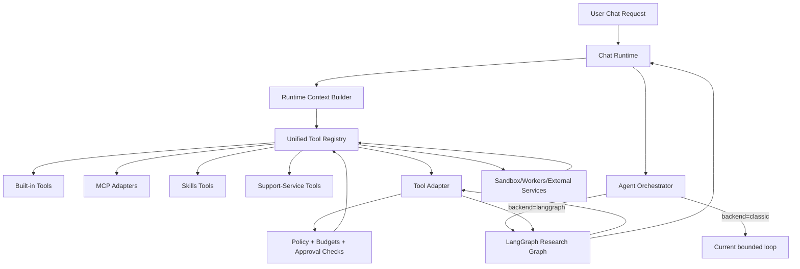

# LangGraph + MCP + Unified Tool Runtime Design

**Date:** 2026-03-26
**Status:** Design (principal-engineering review)
**Related:**

- [MCP, Skills, and Agents Structure Implementation Plan](../roadmap/plans/pending/2026-03-20-mcp-skills-agents-structure.md)
- [Agentic Support Services (Vendor-Agnostic Controlled Access) Implementation Plan](../roadmap/plans/pending/2026-03-20-agentic-support-services-vendor-agnostic.md)
- [LangGraph Research Orchestration Integration Plan](../roadmap/plans/pending/2026-03-25-langgraph-research-orchestration.md)
- [MCP + Skills + Agents Runtime Architecture (placeholder)](../documents/architecture/mcp-skills-agents-runtime.md)
- [Research source connectors - pluggable integration design](./2026-03-25-research-source-connectors-design.md)

## Problem

AquiLLM has strong tool-level capabilities (document retrieval, astronomy, debug tools, planned MCP, planned skills, planned support-services), but orchestration is still primarily a bounded tool-calling loop bound to chat turn flow. That is sufficient for short interactive calls, but it is not a strong fit for long-running research workflows that need:

- explicit step state,
- resumable execution,
- deterministic approval gates,
- iterative evidence -> hypothesis -> experiment loops,
- and policy/audit visibility across many tool calls.

We need a design where:

- AquiLLM remains the source of truth for capabilities and policy,
- orchestration can express multi-step scientific workflows,
- and non-agent chat reliability is not regressed.

## Goals

1. **Preserve one canonical capability path**
   - Built-in tools, MCP tools, skills, and support-services all register through one AquiLLM runtime tool path (`LLMTool`-compatible).
2. **Introduce a first-class orchestration layer**
   - Add LangGraph as an optional backend for agent orchestration with typed state and explicit transitions.
3. **Keep policy and safety in AquiLLM runtime**
   - Budgets, allowlists, stop rules, and approval checks are enforced outside LangGraph node internals.
4. **Keep heavy execution off chat runtime**
   - Numerical/symbolic/simulation work runs in sandboxed Python, workers, or service adapters exposed via tools.
5. **Enable incremental adoption**
   - Feature-flagged rollout; default remains existing chat behavior and existing classic loop backend.
6. **Support research-specific flow quality**
   - Start with one orchestrated research graph, then evolve to specialist subgraphs only where measurable benefit exists.

## Non-goals (Phase 1)

- Replacing the `LLMTool` contract.
- Replacing MCP/skills registry work with LangGraph-specific tool definitions.
- Starting with multi-agent persona swarms.
- Executing arbitrary user code inside orchestration nodes.

## Architecture Decision

Use the following strict layering:

- **Tool registry (what the system can do):** AquiLLM runtime tool composition (`apps/chat/services/tool_registry.py` + planned `lib/mcp`, `lib/skills`, `lib/agent_services`).
- **Orchestration (how it decides next action):** LangGraph backend in `lib/agents`.
- **Policy/safety (what is allowed):** AquiLLM policy services (`lib/agents/policy.py`, `lib/agent_services/policy.py`, runtime flags).
- **Execution substrate (where work runs):** sandbox workers, Celery tasks, and external controlled services.

This preserves vendor/orchestrator portability: orchestration can change without redefining capabilities.

## Current-State Anchors (codebase)

Current seams that this design targets:

- `apps/chat/consumers/chat.py` currently assembles runtime tools inline in `connect()`.
- `apps/chat/services/tool_wiring/*` contains current built-in tool factories.
- `lib/llm/providers/base.py` provides the current bounded tool loop (`spin`) and tool call execution.
- Roadmap already defines the intended runtime extensibility path (`apps/chat/services/runtime_context.py` and `tool_registry.py`).

The new design does not discard these seams; it reorganizes them into explicit runtime composition and orchestration backends.

## Proposed Runtime Topology

## Core Contracts

### 1) Runtime Tool Registry Contract

All tool sources produce `LLMTool`-compatible artifacts. Registry composition order is deterministic.

Inputs:

- runtime context (user, convo, collection scope, feature flags, policy profile)
- source toggles (`MCP_ENABLED`, skills enabled, support-services enabled)

Outputs:

- ordered tool list
- provenance metadata per tool (source, module, policy class)

Rules:

- Duplicate tool names are rejected or namespaced via explicit policy.
- Registry failures are source-scoped (a failing source does not crash all tool assembly).
- Registry output is the only tool surface visible to orchestration backends.

### 2) Orchestrator Backend Contract

Define a backend interface in `lib/agents/backends/base.py`:

- `run(context, conversation) -> OrchestratorResult`
- `resume(run_id, user_input) -> OrchestratorResult`
- `cancel(run_id) -> CancelResult`
- `describe_state(run_id) -> OrchestratorState`

Backends:

- `classic_loop`: existing bounded tool loop behavior.
- `langgraph`: typed stateful workflow.

### 3) LangGraph Tool Adapter Contract

LangGraph nodes do not call raw tools directly. They use adapter methods:

- `invoke_tool_for_agent(tool_name, args, state_context) -> normalized_result`
- `request_approval(action, rationale, state_context) -> approval_token`

Adapter responsibilities:

- resolve tool by name from runtime registry
- run policy checks before invocation
- execute with timeout/retry constraints
- normalize success/error payloads
- append audit event to graph state

## Research Graph (Phase 1)

Phase-1 graph is intentionally single-agent and explicit.

Nodes:

1. `TaskIntakeNode`
2. `PlannerNode`
3. `EvidenceRetrievalNode`
4. `HypothesisFormalizationNode`
5. `ExperimentExecutorNode`
6. `ResultCriticNode`
7. `ReportWriterNode`
8. `HumanApprovalGateNode`

Transition policy:

- `PlannerNode` decides whether retrieval is required.
- `ResultCriticNode` decides stop, revise, or run another experiment.
- `HumanApprovalGateNode` blocks actions requiring confirmation and can resume.
- Any node can terminate via bounded hard-stop reasons (`max_steps`, `budget_exhausted`, `policy_denied`, `insufficient_evidence`).

## Typed Graph State Schema

Minimum state model:

- identity: `run_id`, `conversation_id`, `user_id`, timestamps
- intake: objective, constraints, success criteria
- planning: hypotheses, planned experiments, dependency graph
- evidence: citations/artifacts with provenance and confidence
- formalization: equations/assumptions/model parameters
- experiments: submitted/running/completed experiments + result references
- critique: validity checks, alternative explanations, missing evidence
- report: answer, confidence, limitations, reproducibility notes
- control: current node, step counters, retries, stop reason, terminal flag
- approvals: pending approval requests and outcomes
- budgets: token/tool/cost/time remaining snapshots
- audit: append-only events for node transitions and tool invocations

State invariants:

- terminal state requires explicit `stop_reason`.
- each tool event includes tool name, args hash, duration, outcome.
- approval-required actions cannot execute while approval is pending.

## Policy and Guardrails

Policy stays in AquiLLM runtime and is shared across backends.

Required guardrails:

- max graph steps and per-node retry caps
- per-tool timeout and per-run tool-call limits
- allowlist/denylist by tool class/source (built-in/MCP/skills/support-service)
- budget limits (token/cost/time)
- approval-required classes for external-impact actions
- deterministic stop reasons and audit logs for every blocked action

Fail-closed behavior:

- policy parsing failures disable backend selection to `classic`.
- disallowed tools produce structured policy denial events, not generic exceptions.

## Execution Boundaries (scientific compute)

LangGraph orchestration must never be the compute engine.

Heavy execution pathways are tool-backed and isolated:

- sandboxed Python execution tools,
- Celery/queue workers,
- controlled provider adapters in `lib/agent_services`.

Graph nodes schedule and evaluate; they do not perform heavy compute in-process.

## MCP and Skills Integration Model

MCP and skills remain tool sources, not orchestration engines.

- MCP tools are discovered/adapted to `LLMTool` and merged into runtime registry.
- Skills may contribute tools and optional prompt extras through skill contracts.
- LangGraph uses the same resolved runtime tool list regardless of source.

This ensures feature symmetry:

- non-agent chat can call the same tools,
- classic-loop agents and LangGraph agents share capabilities,
- policy and observability remain centralized.

## Observability and Operations

Emit structured events at three layers:

1. registry: tool-source loading outcomes
2. orchestration: node enter/exit, transition reason, step counts
3. invocation: tool call latency, policy decision, result class

Required fields:

- `run_id`, `conversation_id`, `user_id` (or hashed id), `backend`, `node`, `tool_name`, `duration_ms`, `outcome`, `stop_reason`

Operational controls:

- backend selector (`classic` default)
- LangGraph enable flag
- node retry caps
- approval-required node/action config
- global emergency fallback to `classic`

## Rollout Strategy

### Phase 0: Registry foundation

Complete MCP/skills unified registry path in `apps/chat/services` per existing pending plan.

### Phase 1: LangGraph single research graph

- add backend abstraction + selector
- add typed state and checkpointing
- implement phase-1 research graph
- wire behind feature flags

### Phase 2: Specialist subgraphs

Introduce optional subgraphs only when phase-1 metrics justify decomposition:

- literature subgraph
- math/simulation subgraph
- critique/validation subgraph

### Phase 2.5: parallel multi-run orchestration

Support two patterns with shared policy and registry controls:

- **parallel independent projects:** multiple research runs active at once per user/workspace
- **combined research mode:** one parent run fans out to child runs (specialists/workstreams), then fans in through a deterministic merge stage

Phase 2.5 requirements:

- scheduler with per-user and global concurrency limits
- queued admission and deterministic dequeue policy
- parent-child budget partitioning and aggregate hard stops
- shared-artifact protocol for evidence exchange across child runs
- merge stage with dedupe + contradiction detection + unified report synthesis

### Phase 3: selective multi-agent

Only for tasks where measured uplift outweighs added complexity.

### Phase 4: automatic verification and reproducibility

Before unattended finalization, run a verification stage that produces a machine-readable report card and enforces configurable pass/warn/fail policy.

Phase 4 requirements:

- claim-to-evidence coverage verification
- provenance/citation completeness verification
- deterministic replay sampling for selected tool outputs
- contradiction/uncertainty threshold checks
- finalization gate policy with optional human override controls

## Verification Requirements

Must-have tests:

- registry determinism and collision handling
- backend selector correctness and fallback behavior
- state validation and checkpoint resume
- transition correctness for all graph edges
- policy-denied tool calls produce explicit outcomes
- non-agent chat regressions remain green
- parallel scheduler fairness and starvation resistance
- parent-child fan-out/fan-in merge determinism
- verification check correctness and deterministic replay behavior
- verification gate behavior (`pass`/`warn`/`fail`) in finalization flow

Must-have scenario evaluation:

- literature-heavy query
- compute-heavy query requiring sandbox execution
- ambiguous question requiring critique loop
- policy-denied action requiring human approval
- concurrent independent projects from same user
- combined research run that merges conflicting child findings
- run with intentionally weak evidence links to confirm verification failure routing

Success gate before broader rollout:

- LangGraph backend achieves equal-or-better completion quality in research scenarios.
- No policy bypasses under test.
- Hard limits always terminate deterministically.
- Classic and non-agent paths remain stable.
- Parallel runs remain within configured concurrency and budget limits.
- Unattended final outputs are blocked on verification failure unless override policy is explicitly configured.

## File-Level Design Mapping

Planned additions and modifications:

- Add `lib/agents/backends/*` for orchestration backend abstraction.
- Add `lib/agents/langgraph/*` for state, nodes, graph, tool adapter, checkpoints.
- Add `lib/agents/multi_run/*` for parallel scheduling, parent-child coordination, and merge logic.
- Add `lib/agents/verification/*` for checks, runner, and report card generation.
- Modify `lib/agents/orchestrator.py` to route by backend selector.
- Modify `apps/chat/services/tool_registry.py` to expose stable invocation entrypoints.
- Modify `apps/chat/services/agent_runtime.py` and `apps/chat/consumers/chat.py` to use orchestrator service, not inline assembly.
- Modify settings and env docs for backend and guardrail controls.
- Update `docs/documents/architecture/mcp-skills-agents-runtime.md` with concrete runtime layering once implementation lands.

## Risks and Mitigations

1. **Risk: dual orchestration drift (classic vs langgraph)**
   - Mitigation: shared backend interface + shared policy and registry path.
2. **Risk: hidden policy bypass in node logic**
   - Mitigation: enforce all tool invocation through adapter and policy gate.
3. **Risk: state bloat for long runs**
   - Mitigation: checkpoint compaction and bounded artifact references.
4. **Risk: rollout instability**
   - Mitigation: feature flags, canary cohorts, immediate fallback to classic backend.
5. **Risk: parallel run starvation or noisy-neighbor effects**
   - Mitigation: queue admission, fairness policy, per-user/global concurrency caps, and budget partitioning.
6. **Risk: verification false positives/negatives**
   - Mitigation: threshold tuning, replay sampling policy, and human override workflow with audit trail.

## Open Questions

1. Preferred checkpoint store for phase-1 (DB table vs existing persistence object store).
2. Exact approval UX surface for paused research runs in chat.
3. Whether to expose backend selection per-user, per-workspace, or environment-global initially.
4. Should combined-research fan-out be user-directed only, or can planner trigger it automatically behind policy gates?
5. What default verification thresholds should block unattended finalization in production?

## Decision Summary

- Adopt LangGraph as optional orchestration backend.
- Keep AquiLLM registry as canonical capability layer.
- Keep policy enforcement and execution boundaries in AquiLLM runtime.
- Start with one explicit research graph, then add Phase 2.5 parallel orchestration and Phase 4 automatic verification before broader multi-agent patterns.
